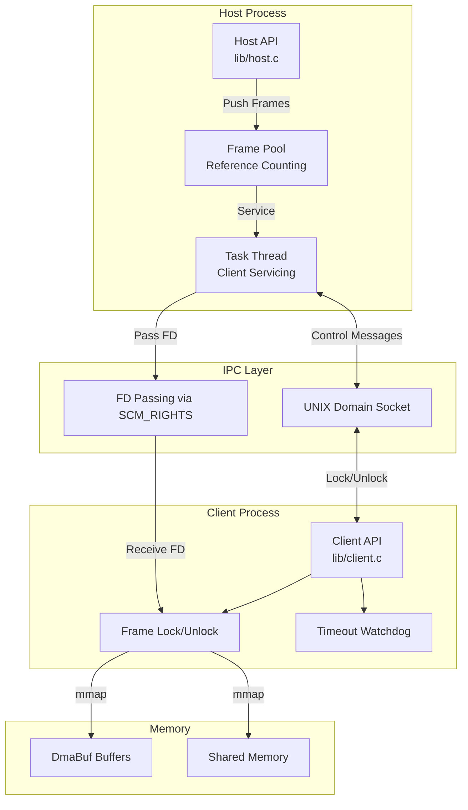
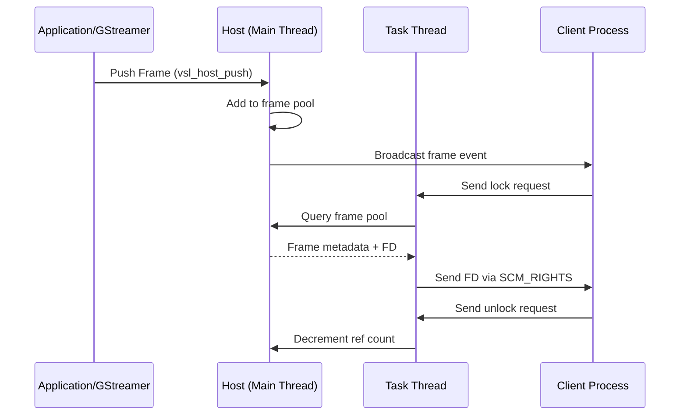
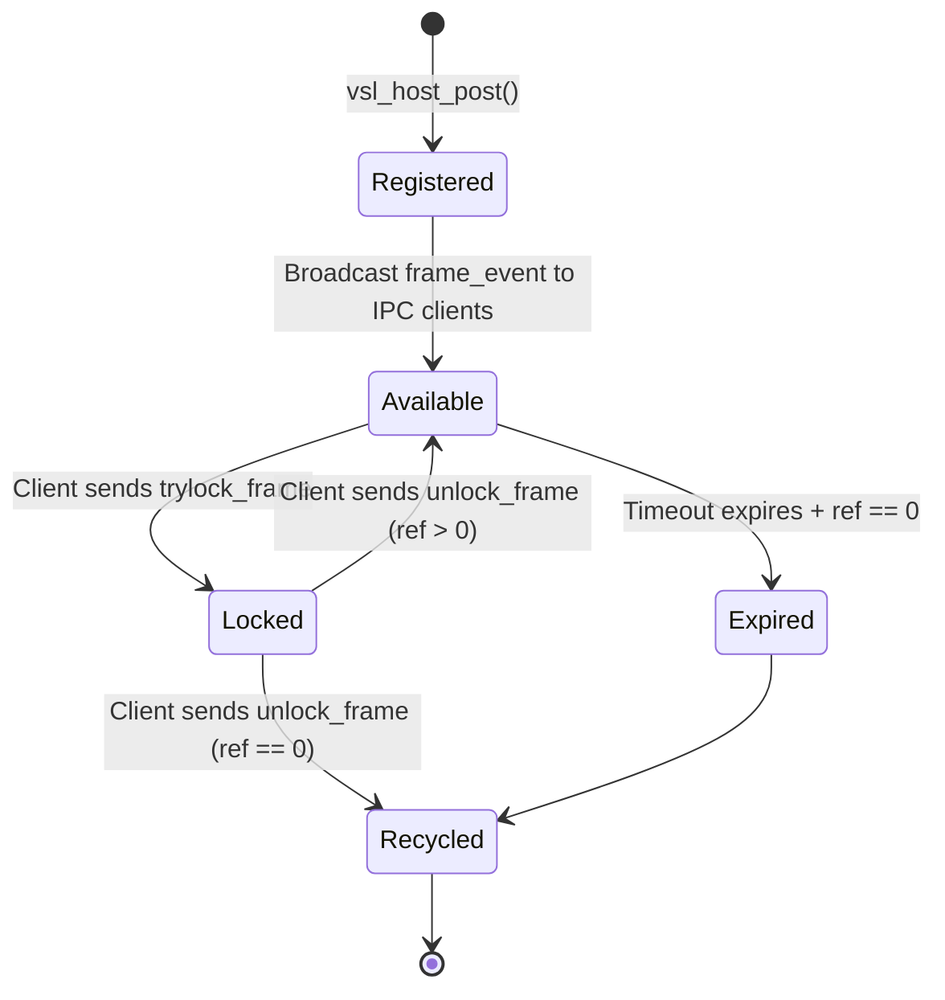
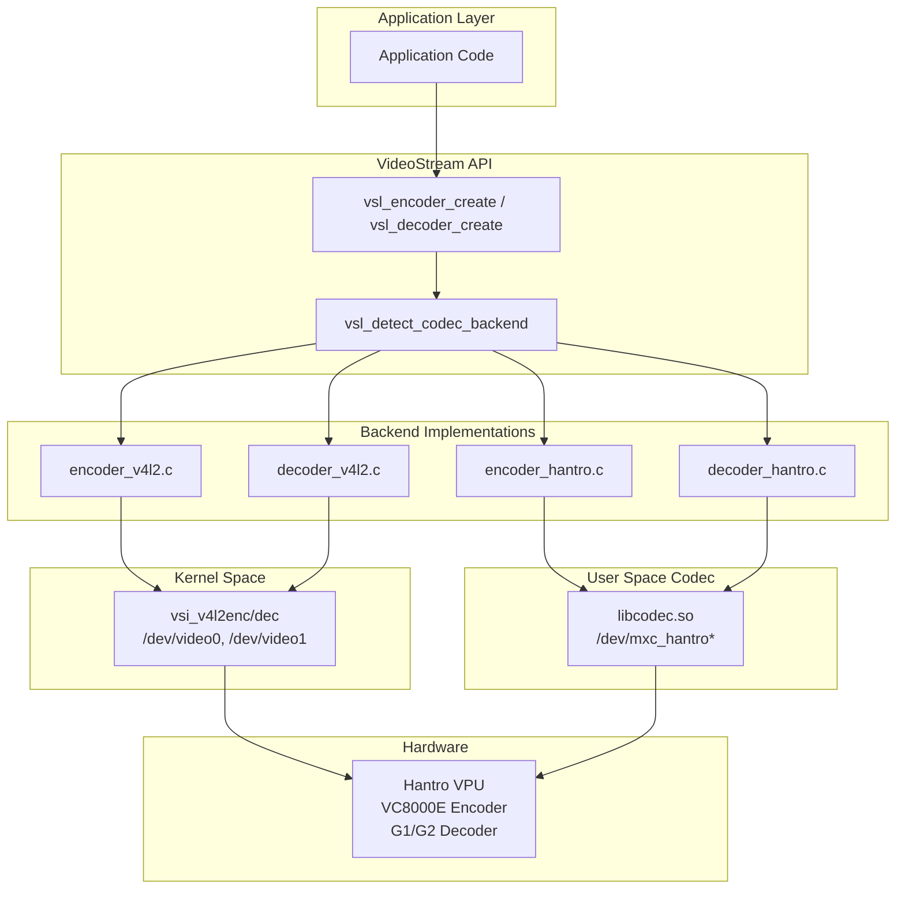
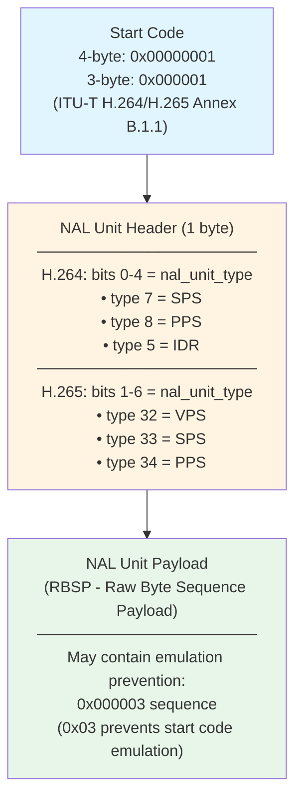

# VideoStream Library - Architecture Guide

**Version:** 2.1
**Last Updated:** 2026-01-01
**Audience:** Developers contributing to VideoStream or integrating it into EdgeFirst Perception

---

## Table of Contents

1. [Overview](#overview)
2. [Core Components](#core-components)
3. [Threading Model](#threading-model)
4. [IPC Protocol](#ipc-protocol)
5. [Memory Management](#memory-management)
6. [GStreamer Integration](#gstreamer-integration)
7. [Hardware Acceleration](#hardware-acceleration)
8. [CLI Tools and Rust Bindings](#cli-tools-and-rust-bindings)
9. [Key Implementation Techniques](#key-implementation-techniques)
10. [Source Code Reference](#source-code-reference)

---

## Overview

VideoStream is a library for sharing video frames between Linux processes over UNIX sockets using a host/client architecture. It leverages modern Linux kernel features for efficient zero-copy frame sharing.

**API Naming:** The library uses the `vsl_` prefix (VideoStream Library) for all public APIs. Core types are `VSLHost`, `VSLClient`, and `VSLFrame`. Historical documentation may reference "FrameManager" but this term does not appear in the actual API.

### Design Principles

1. **Zero-Copy** - Use DmaBuf file descriptors to avoid memory copies
2. **Process Isolation** - Host and clients run in separate processes
3. **Robust IPC** - Timeouts and reconnection prevent deadlocks
4. **GStreamer Native** - First-class plugin support

### Key Technologies

- **UNIX Domain Sockets** - Process communication via `AF_UNIX` sockets
- **File Descriptor Passing** - Share memory via `SCM_RIGHTS` ancillary data
- **Linux DmaBuf** - Zero-copy buffer sharing (`dma-buf` subsystem)
- **POSIX Shared Memory** - Fallback when DmaBuf unavailable

---

## Core Components



### Component Responsibilities

| Component | File | Responsibilities |
|-----------|------|------------------|
| **Host** | `lib/host.c` | Frame pool management, client servicing, FD passing |
| **Client** | `lib/client.c` | Connect to host, receive frames, lock/unlock protocol |
| **Frame** | `lib/frame.c` | Frame metadata, memory mapping, reference counting helpers |
| **IPC** | `lib/common.c` | Socket utilities, message serialization |
| **GStreamer Sink** | `gst/vslsink.c` | Host role, receives GstBuffers, creates task thread |
| **GStreamer Source** | `gst/vslsrc.c` | Client role, produces GstBuffers from frames |

---

## Threading Model

### Host Threading

The host process uses **two thread contexts**:



**Implementation Details:**

- **Frame registration:** Called from GStreamer streaming thread or application thread
  - Function: `vsl_host_push()` in `lib/host.c`
  - Protected by `pthread_mutex_t` on frame pool
- **Client servicing:** Dedicated GStreamer task thread (or custom thread)
  - Function: `vsl_host_poll()` in `lib/host.c`
  - Polls socket with 1-second timeout
  - Handles lock/unlock requests from all connected clients

### Client Threading

The client process uses **main thread + POSIX timer**:

**Implementation Details:**

- **Frame waiting:** Blocks on `recv()` until host broadcasts frame event
  - Function: `vsl_frame_wait()` in `lib/client.c`
- **Timeout watchdog:** POSIX timer (`timer_t`) monitors socket inactivity
  - Function: `timer_handler()` in `lib/client.c`
  - Forces reconnection if no activity within timeout period

### Thread Safety

- **Host frame pool:** Protected by single `pthread_mutex_t`
- **Client connection:** Per-client mutex for socket operations
- **GStreamer integration:** Uses GStreamer's `GRecMutex` for task thread

---

## IPC Protocol

### UNIX Domain Socket

VideoStream uses connection-oriented UNIX sockets (`AF_UNIX`, `SOCK_SEQPACKET`) for reliable, ordered message delivery between processes.

**Socket Paths:**

- **Explicit paths**: Set via `path` parameter (e.g., `/tmp/vsl_camera`)
- **Filesystem vs Abstract**: Paths starting with `/` create filesystem entries; paths without `/` are abstract sockets (Linux-specific, see unix(7))
- **Auto-generated (vslsink only)**: When no path specified, vslsink generates `/tmp/<element_name>.<thread_id>`
  - Example: `vslsink` element named "vslsink0" creates `/tmp/vslsink0.12345`
  - Uses `syscall(SYS_gettid)` for thread ID (not process ID)
- **No automatic counter appending**: If path exists, bind fails with `EADDRINUSE` (unless stale, then auto-cleaned)

**Implementation:** See `sockaddr_from_path()` in `lib/common.c` (line 179) and `vsl_host_init()` in `lib/host.c` (line 197)

### Message Types

| Message | Direction | Purpose |
|---------|-----------|---------|
| `FRAME_EVENT` | Host → Client | Broadcast new frame availability |
| `LOCK_REQUEST` | Client → Host | Request frame access |
| `LOCK_RESPONSE` | Host → Client | Grant access with FD |
| `UNLOCK_REQUEST` | Client → Host | Release frame |

### File Descriptor Passing

VideoStream uses `SCM_RIGHTS` ancillary data to pass file descriptors over UNIX sockets, enabling zero-copy frame sharing.

**Implementation:**

```c
// Host side (lib/host.c)
struct msghdr msg = {0};
struct cmsghdr *cmsg;
char cmsg_buf[CMSG_SPACE(sizeof(int))];

cmsg = CMSG_FIRSTHDR(&msg);
cmsg->cmsg_level = SOL_SOCKET;
cmsg->cmsg_type = SCM_RIGHTS;
*(int *)CMSG_DATA(cmsg) = dmabuf_fd;

sendmsg(client_sock, &msg, 0);
```

**Reference:** Functions `vsl_host_service()` and `vsl_client_lock()` in `lib/host.c` and `lib/client.c`

### Frame Lifecycle



**Frame Expiry:**

- Host sets expiry time when posting frame via `vsl_host_post()` `expires` parameter
- Default lifespan in vslsink: 100 milliseconds (configurable via `lifespan` property)
- **Timer disabled**: Set `expires` to 0 for manual frame recycling (no automatic expiry)
- Frames only recycled when: `ref_count == 0 AND (expires == 0 OR current_time > expires)`

**Key Functions:**

- `vsl_host_post()` - Register frame with host, set expiry, broadcast event
- `vsl_frame_wait()` - Client receives frame_event, blocks until frame available
- `vsl_frame_trylock()` - Client sends trylock request, host responds with FD via SCM_RIGHTS
- `vsl_frame_unlock()` - Client sends unlock request, host decrements ref count
- `expire_frames()` - Host internal function checks and recycles expired frames (lib/host.c:135)

---

## Memory Management

### DmaBuf Zero-Copy Path

VideoStream prefers DmaBuf for zero-copy frame sharing:

**Allocation:**

- Via `/dev/dma_heap/system` (Linux 5.6+)
- Via V4L2 `VIDIOC_EXPBUF` (camera export)

**Sharing:**

1. Host exports DmaBuf FD during frame capture/creation
2. Host passes FD to client via `SCM_RIGHTS`
3. Client calls `mmap()` on received FD
4. Both processes access same physical memory

**Physical Address Access:**

- DmaBuf supports querying physical address via `vsl_frame_paddr()`
- Returns `intptr_t` physical address or `MAP_FAILED` if unavailable
- **Use case**: Pass physical address to hardware accelerators (VPU, NPU, DMA engines)
- **Example**: ModelRunner uses physical addresses for zero-copy model input loading

**Semantic Note:**

- File descriptor passing via `SCM_RIGHTS` is functionally similar to `dup(2)` across process boundaries
- Both processes receive independent FDs referring to same underlying DmaBuf object
- Each process must `close()` their FD when done

**Implementation:** See `v4l2_export_dmabuf()` in `lib/v4l2.c` and `vsl_frame_paddr()` in include/videostream.h (line 862)

### VPU Encoder/Decoder DMA Heap Allocation

**Problem**: VPU wrapper library (`VPU_EncGetMem`, `VPU_DecGetMem`) allocates contiguous memory without providing dmabuf FDs, preventing cross-process sharing of encoded/decoded frames.

**Solution**: Custom DMA heap allocators that provide both hardware-accessible physical addresses and shareable file descriptors.

#### Encoder Output Allocation

**File**: `lib/encoder_hantro_dmabuf.c`

**Function**: `vsl_encoder_new_output_frame_dmabuf()`

**Process**:
1. Allocate 1MB buffer from `/dev/dma_heap/linux,cma-uncached` (preferred) or `/dev/dma_heap/linux,cma`
2. Get physical address via custom `DMA_BUF_IOCTL_PHYS` ioctl
3. `mmap()` buffer for CPU access
4. Return frame with:
   - `frame->handle` = dmabuf FD (for IPC)
   - `frame->info.paddr` = physical address (for VPU hardware)
   - `frame->map` = virtual address (for CPU)

**VPU Integration**:
```c
// lib/encoder_hantro.c
VpuEncEncParam params;
params.nInPhyOutput = frame->info.paddr;    // VPU writes to this physical address
params.nInVirtOutput = (unsigned long)frame->map;  // CPU can read from here
params.nInOutputBufLen = frame->mapsize;     // 1MB pre-allocated
VPU_EncEncodeFrame(encoder->handle, &params);
// VPU writes encoded data, updates frame->info.size with actual bytes
```

**Size Strategy**:
- Pre-allocate 1MB (sufficient for 1080p H.264/HEVC keyframes)
- Actual encoded size varies (keyframes: 50-200KB, P-frames: 10-50KB)
- VPU updates `frame->info.size` with actual compressed size

**Fallback**: If DMA heap unavailable, falls back to `VPU_EncGetMem()` with warning that cross-process sharing won't work.

#### Decoder Frame Buffer Allocation

**File**: `lib/decoder_hantro_dmabuf.c`

**Function**: `vsl_decoder_alloc_frame_buffers_dmabuf()`

**Complexity**: Decoder requires multiple buffers (typically 5-10) for H.264/HEVC reference frames.

**Process**: For each frame buffer:
1. Calculate total size: Y plane + Cb plane + Cr plane + MV data
2. Allocate from DMA heap
3. Get physical address via `DMA_BUF_IOCTL_PHYS`
4. `mmap()` for CPU access
5. Fill `VpuFrameBuffer` structure with plane addresses
6. Store dmabuf FD in decoder structure for cleanup

**VPU Integration**:
```c
// lib/decoder_hantro.c
VpuFrameBuffer frameBuf[bufNum];
// Fill each buffer with addresses from dmabuf allocations
frameBuf[i].pbufY = phys_addr;
frameBuf[i].pbufVirtY = virt_addr;
// ... similar for Cb, Cr, MV planes
VPU_DecRegisterFrameBuffer(decoder->handle, frameBuf, bufNum);
// VPU writes decoded frames to these physical addresses
```

**Cleanup**: `vsl_decoder_release()` closes all dmabuf FDs and unmaps all buffers.

**Tracking**: Decoder structure extended to track:
- `frameBufCount`: Number of buffers allocated
- `frameBufFds[]`: Array of dmabuf file descriptors
- `frameBufMaps[]`: Array of mmap pointers
- `frameBufYSize`, `frameBufUSize`, etc.: Sizes for cleanup

**Result**: Both encoder output and decoder output frames can now be shared across processes via `SCM_RIGHTS`, enabling:
- Camera → Encoder → Host → Client → Decoder pipelines
- Zero-copy throughout entire video processing chain
- Hardware acceleration with cross-process IPC

### POSIX Shared Memory Fallback

When DmaBuf unavailable:

**Allocation:**

```c
// lib/host.c or lib/frame.c
int shm_fd = shm_open("/vsl-frame-<serial>", O_CREAT | O_RDWR, 0600);
ftruncate(shm_fd, frame_size);
```

**Cleanup:** Host calls `shm_unlink()` when frame recycled

### Reference Counting

Frame reference counting ensures frames aren't recycled while clients are using them:

- **Initial state:** Reference count starts at 0 when frame posted
- **Lock:** Each `trylock` increments `frame->info.locked` count
- **Unlock:** Each `unlock` decrements `frame->info.locked` count
- **Recycle condition:** Frame recycled when `locked == 0 AND (expires == 0 OR current_time > expires)`

**Per-Client Tracking:**

- Host maintains up to 20 frames per client socket (`MAX_FRAMES_PER_CLIENT`)
- When client disconnects, host automatically decrements all locked frames for that client

**Implementation:**

- Reference count stored in `frame->info.locked` field (lib/frame.h)
- Protected by `pthread_mutex_t` in `VSLHost` structure (lib/host.c:38)
- See `add_frame_to_socket()` and `remove_frame_from_socket()` in lib/host.c

---

## GStreamer Integration

### vslsink (Host Role)

**Plugin:** `gst/vslsink.c`

Receives GstBuffers from upstream GStreamer elements and shares them with clients:

1. **render() callback:** Receives GstBuffer from GStreamer pipeline
2. **Extract metadata:** Width, height, format, timestamp
3. **Check for DmaBuf:** Prefer DmaBuf-backed GstMemory, fallback to copy
4. **Register frame:** Call `vsl_host_push()`
5. **Task thread:** Services client lock/unlock requests via `vsl_host_poll()`

**Properties:**

- `path` (string) - UNIX socket path
- `lifespan` (int64) - Frame timeout in milliseconds

### vslsrc (Client Role)

**Plugin:** `gst/vslsrc.c`

Produces GstBuffers from shared frames for downstream GStreamer processing:

1. **create() callback:** Called by GStreamer when buffer needed
2. **Wait for frame:** Call `vsl_frame_wait()` with timeout
3. **Lock frame:** Call `vsl_frame_trylock()`, receive FD
4. **Wrap in GstBuffer:** Create GstMemory from mmap'd FD
5. **Custom allocator:** Calls `vsl_frame_unlock()` when GstBuffer finalized

**Properties:**

- `path` (string) - UNIX socket path to connect
- `timeout` (float) - Frame wait timeout in seconds
- `reconnect` (boolean) - Auto-reconnect on disconnect

---

## Hardware Acceleration

### Codec Backend Architecture

VideoStream supports dual codec backends for hardware video encoding/decoding:



### Backend Selection

The library automatically selects the best available backend, with manual override options.

**Backend Enum:**

```c
typedef enum {
    VSL_CODEC_BACKEND_AUTO = 0,   // Auto-detect best backend (default)
    VSL_CODEC_BACKEND_HANTRO = 1, // Force Hantro/libcodec.so
    VSL_CODEC_BACKEND_V4L2 = 2,   // Force V4L2 kernel driver
} VSLCodecBackend;
```

**Extended API:**

```c
// Explicit backend selection
VSLDecoder* vsl_decoder_create_ex(uint32_t codec, int fps, VSLCodecBackend backend);
VSLEncoder* vsl_encoder_create_ex(VSLEncoderProfile profile, uint32_t codec,
                                   int fps, VSLCodecBackend backend);

// Original API uses AUTO (backwards compatible)
VSLDecoder* vsl_decoder_create(uint32_t codec, int fps);
VSLEncoder* vsl_encoder_create(VSLEncoderProfile profile, uint32_t codec, int fps);
```

**Environment Variable Override:**

```bash
# Force Hantro backend even if V4L2 available
VSL_CODEC_BACKEND=hantro ./my_app

# Force V4L2 (fail if unavailable)
VSL_CODEC_BACKEND=v4l2 ./my_app

# Auto-detect (default)
VSL_CODEC_BACKEND=auto ./my_app
```

**Detection Priority:**

1. Check `VSL_CODEC_BACKEND` environment variable
2. Check V4L2 device availability (`/dev/video0` encoder, `/dev/video1` decoder)
3. Fallback to Hantro devices (`/dev/mxc_hantro_vc8000e`, `/dev/mxc_hantro`)

**Implementation:** `lib/codec_backend.c`, `lib/decoder.c`, `lib/encoder.c`

### V4L2 Codec Backend

**Implementation:** `lib/encoder_v4l2.c`, `lib/decoder_v4l2.c`

The V4L2 backend uses the Linux kernel's mem2mem (M2M) interface for hardware codecs:

**Device Nodes (i.MX 8M Plus):**

| Device | Driver | Function | Max Resolution |
|--------|--------|----------|----------------|
| `/dev/video0` | vsi_v4l2enc | H.264/HEVC Encoder | 1920x1080 @ 60fps |
| `/dev/video1` | vsi_v4l2dec | H.264/HEVC/VP9 Decoder | 4096x2160 @ 60fps |

**V4L2 mem2mem Model:**

```
            ┌─────────────────────────────────────────┐
            │           V4L2 mem2mem Device           │
            │                                         │
 Raw/Enc    │  ┌─────────┐         ┌─────────────┐   │   Enc/Raw
  Data  ───►│  │ OUTPUT  │ ──────► │   CAPTURE   │   │──► Data
            │  │ Queue   │  (HW)   │    Queue    │   │
            │  └─────────┘         └─────────────┘   │
            │                                         │
            └─────────────────────────────────────────┘

Encoder: OUTPUT=raw NV12/BGRA, CAPTURE=H.264/HEVC
Decoder: OUTPUT=H.264/HEVC, CAPTURE=raw NV12
```

**Key Features:**

- **DMABUF zero-copy:** Input frames passed via DMA file descriptors
- **Multi-format input:** NV12, BGRA, and other pixel formats
- **Crop-based 4K tiling:** V4L2 selection API for encoding 4K as four 1080p tiles
- **Codec controls:** Bitrate, GOP size, profile, level via V4L2 extended controls

**4K Tiling Support:**

Since the encoder hardware (VC8000E) supports max 1920x1080, 4K encoding uses crop regions:

```
┌─────────────────────────────────────────┐
│            4K Source (3840x2160)        │
│  ┌─────────────────┬─────────────────┐  │
│  │   Tile 0        │   Tile 1        │  │
│  │   (0,0)         │   (1920,0)      │  │
│  │   1920x1080     │   1920x1080     │  │
│  ├─────────────────┼─────────────────┤  │
│  │   Tile 2        │   Tile 3        │  │
│  │   (0,1080)      │   (1920,1080)   │  │
│  │   1920x1080     │   1920x1080     │  │
│  └─────────────────┴─────────────────┘  │
└─────────────────────────────────────────┘
```

### Hantro VPU Backend

**Implementation:** `lib/encoder_hantro.c`, `lib/decoder_hantro.c`

User-space codec via NXP's libcodec.so and vpu_wrapper:

- **VPU wrapper library:** Abstraction over Hantro hardware
- **Zero-copy input:** Encode directly from DmaBuf physical addresses
- **Codec support:** H.264 (AVC), H.265 (HEVC), VP8

**Device Nodes:**

| Device | Function |
|--------|----------|
| `/dev/mxc_hantro_vc8000e` | Encoder access |
| `/dev/mxc_hantro` | Decoder access |

**Note:** The Hantro backend has higher latency than V4L2 for 1080p+ content (see Performance Comparison below).

### V4L2 Camera Capture

**Implementation:** `lib/v4l2.c`

VideoStream interfaces directly with Video4Linux2 drivers:

- **DmaBuf export:** `VIDIOC_EXPBUF` to get FD from camera buffer
- **Format negotiation:** `VIDIOC_S_FMT` for resolution and pixel format
- **Buffer management:** `VIDIOC_QBUF`/`VIDIOC_DQBUF` for capture
- **Exclusive locking:** `flock()` prevents concurrent camera access

**Key Functions:**

- `v4l2_open_device()` - Open camera device
- `v4l2_set_format()` - Configure capture format
- `v4l2_start_streaming()` - Begin frame capture
- `v4l2_capture_frame()` - Dequeue captured frame

### G2D Blitting (NXP i.MX8)

**Implementation:** `lib/g2d.c`

Hardware-accelerated format conversion and scaling:

- **G2D library:** NXP's 2D graphics acceleration
- **Format conversion:** YUV ↔ RGB, NV12 ↔ YUYV, etc.
- **Scaling:** Arbitrary resolution changes


---

## CLI Tools and Rust Bindings

### VideoStream CLI (`videostream`)

**Implementation:** `crates/videostream-cli/src/`

The `videostream` command-line tool provides high-level operations beyond the core C API, including camera streaming, recording, format conversion, and performance measurement.

#### Architecture

```
┌─────────────────────────────────────────────────────────────┐
│ VideoStream CLI (videostream binary)                        │
│  ┌───────────┬──────────┬──────────┬──────────┬──────────┐ │
│  │ stream.rs │record.rs │convert.rs│receive.rs│  info.rs │ │
│  └─────┬─────┴────┬─────┴────┬─────┴────┬─────┴─────┬────┘ │
│        │          │          │          │           │      │
│        └──────────┴──────────┴──────────┴───────────┘      │
│                            ↓                                │
│               ┌────────────────────────────┐                │
│               │ Rust Bindings (videostream)│                │
│               │  Safe API Layer            │                │
│               └────────────┬───────────────┘                │
│                            ↓                                │
│               ┌────────────────────────────┐                │
│               │ C Library (libvideostream) │                │
│               │  Core IPC and Hardware     │                │
│               └────────────────────────────┘                │
└─────────────────────────────────────────────────────────────┘
```

#### Commands

| Command | Purpose | Key Features |
|---------|---------|--------------|
| **stream** | Camera → Socket streaming | Raw/encoded frames, VPU encoding, metrics |
| **record** | Camera → File recording | Annex B H.264/H.265, power-loss resilient |
| **convert** | Annex B → MP4 container | SPS/PPS extraction, AVCC format |
| **receive** | Socket → Performance test | Latency measurement, frame validation |
| **info** | System capabilities | Camera enumeration, VPU detection |

#### Value-Added Features Beyond C API

The CLI provides several capabilities not present in the core C library:

**1. Annex B Bitstream Handling**

- **Recording format:** Raw H.264/H.265 Annex B bitstream (power-loss resilient)
- **SPS/PPS extraction:** Parse parameter sets from encoder output
- **Start code detection:** ITU-T H.264/H.265 Annex B.1 compliant parser
- **NAL unit splitting:** Handles 3-byte (0x000001) and 4-byte (0x00000001) start codes
- **MP4 muxing:** Convert Annex B to MP4 container with AVCC format conversion

Implementation: `crates/videostream-cli/src/utils.rs` (`parse_nal_units()`, `extract_parameter_sets_h264()`)

**2. Performance Metrics**

- **Latency tracking:** Frame timestamp to receive time (p50/p95/p99 percentiles)
- **Throughput measurement:** FPS and bandwidth calculations
- **Drop detection:** Serial number gap analysis
- **JSON output:** Machine-parseable metrics for CI/CD integration

Implementation: `crates/videostream-cli/src/metrics.rs` (`MetricsCollector`)

**3. Hardware Capability Detection**

- **Camera enumeration:** V4L2 device discovery with format/resolution listing
- **VPU detection:** Runtime detection of H.264/H.265 encoder/decoder availability
- **Format validation:** Check camera support for requested pixel formats
- **JSON schema:** Structured output for automation

Implementation: `crates/videostream-cli/src/info.rs`

**4. Configuration Helpers**

- **Bitrate → profile mapping:** Automatic VPU profile selection (5/25/50/100 Mbps tiers)
- **Resolution parsing:** "WxH" string to width/height conversion
- **FOURCC conversion:** Human-readable format strings to 32-bit identifiers
- **Codec detection:** File extension → codec type auto-detection

Implementation: `crates/videostream-cli/src/utils.rs`

**5. Integration Testing**

The CLI serves as a comprehensive test harness:

- **End-to-end workflows:** Camera → encode → stream → decode → record
- **Error handling:** Validates all failure paths (missing camera, VPU unavailable, etc.)
- **Platform verification:** Confirms hardware acceleration availability
- **CI/CD automation:** Runs on both x86-64 and aarch64 in GitHub Actions

Implementation: `crates/videostream-cli/tests/cli.rs` (39 integration tests)

### Rust Bindings (`videostream` crate)

**Implementation:** `crates/videostream/src/`

Safe Rust API wrapping the C library with idiomatic error handling and memory safety.

#### Key Abstractions

| Module | Purpose | Core Types |
|--------|---------|------------|
| `frame` | Frame lifecycle | `Frame` (RAII wrapper) |
| `host` | Publisher role | `Host` (socket server) |
| `client` | Subscriber role | `Client` (socket client) |
| `camera` | V4L2 capture | `Camera`, `CameraReader` |
| `encoder` | VPU encoding | `Encoder` (H.264/H.265) |
| `decoder` | VPU decoding | `Decoder` (H.264/H.265) |

#### Memory Safety

- **RAII wrappers:** Frames automatically freed via `Drop` implementation
- **Borrow checking:** Rust prevents double-free and use-after-free
- **Lifetime management:** Camera buffers outlive frame references
- **Null pointer validation:** All C pointers checked before dereferencing

Example from `crates/videostream-cli/src/record.rs`:

```rust
// Buffer MUST outlive input_frame (borrows buffer data)
let buffer = camera.read()?;
{
    let input_frame: Frame = (&buffer).try_into()?;
    encoder.frame(&input_frame, &output_frame, &crop, &mut keyframe)?;
    // input_frame drops here, before buffer
}
// buffer drops here - safe because input_frame is already dropped
```

### Annex B Bitstream Format

The CLI's recording and conversion features work with ITU-T H.264/H.265 Annex B format:

#### Start Code Structure



#### Why Annex B for Recording?

**Power-Loss Resilience:** Annex B streams remain valid even if truncated mid-frame:
- Each NAL unit has a start code prefix
- No container-level index or metadata required
- Decoder can resync at next start code after corruption
- Suitable for embedded systems with power instability

**Contrast with MP4:** ISO base media file format requires:
- Complete `moov` atom with frame index at file end
- Incomplete file = unplayable without recovery
- Requires `fseek()` for muxing (incompatible with streaming)

#### Annex B → MP4 Conversion

The `convert` command transforms Annex B to MP4 for compatibility:

1. **Parse NAL units:** Split on start codes (3 or 4 bytes)
2. **Extract SPS/PPS:** Find NAL types 7 and 8 (H.264) or 33/34 (H.265)
3. **Parse SPS for resolution:** Decode sequence parameter set (Section 7.3.2.1)
4. **Convert to AVCC format:** Replace start codes with 4-byte length prefixes
5. **Write MP4 container:** Create `ftyp`, `moov`, and `mdat` atoms

Implementation: `crates/videostream-cli/src/convert.rs` (`detect_resolution_from_sps()`)

Reference: ITU-T H.264 (ISO/IEC 14496-10) Annex B, ITU-T H.265 (ISO/IEC 23008-2) Annex B

---

## Key Implementation Techniques

### 1. File Descriptor Passing

Sharing memory between processes without copying:

**Technique:** Use `sendmsg()`/`recvmsg()` with `SCM_RIGHTS` ancillary data to pass file descriptors (DmaBuf or shm FDs) over UNIX domain sockets.

**Why:** Allows client processes to `mmap()` the same buffer as host using the received FD, enabling zero-copy access.

**Code:** `lib/host.c` (send side), `lib/client.c` (receive side)

### 2. Reference Counting for Multi-Consumer

Preventing premature frame recycling:

**Technique:** Host maintains reference count for each frame. Lock increments, unlock decrements. Frame recycled only when count reaches zero AND timeout expired.

**Why:** Multiple clients can access same frame simultaneously without interference or premature deletion.

**Code:** Frame pool management in `lib/host.c`

### 3. Timeout Management

Preventing deadlocks and resource leaks:

**Host-side timeout:**

- Frame lifespan timer ensures stale frames are recycled
- Implementation: POSIX timers or polling check in task thread

**Client-side timeout:**

- Socket inactivity watchdog forces reconnection
- Implementation: POSIX timer (`timer_t`) in `lib/client.c`

**Why:** Prevents indefinite resource consumption and handles crashed processes gracefully.

### 4. Non-Blocking Client Servicing

Responsive host operation:

**Technique:** Host task thread uses `poll()` or `select()` with timeout on client sockets, services requests as they arrive.

**Why:** Host remains responsive even with slow or misbehaving clients.

**Code:** `vsl_host_poll()` in `lib/host.c`

### 5. DmaBuf Fallback to Shared Memory

Platform compatibility:

**Technique:** Detect DmaBuf support at runtime, fallback to POSIX shared memory if unavailable.

**Why:** Ensures VideoStream works on systems without DmaBuf support while optimizing for zero-copy when available.

**Allocation Strategy:**

- `vsl_frame_alloc(frame, path)`:
  - If `path` starts with `/dev`, attempt DmaBuf allocation from heap device
  - If `path` is NULL, try DmaBuf from `/dev/dma_heap/system`, fallback to POSIX shm
  - If `path` is set (non `/dev`), use POSIX shm with that path

**Code:** Memory allocation logic in `vsl_frame_alloc()` (lib/frame.c)

---

## Source Code Reference

### Core Library

| File | Purpose |
|------|---------|
| `lib/host.c` | Host implementation, frame pool, client servicing |
| `lib/client.c` | Client implementation, connection, frame operations |
| `lib/frame.c` | Frame structure, mapping, metadata |
| `lib/common.c` | Shared utilities, socket helpers |
| `lib/videostream.c` | Main API entry points |

### Hardware Interfaces

| File | Purpose |
|------|---------|
| `lib/v4l2.c` | Video4Linux2 camera capture |
| `lib/codec_backend.c` | Backend detection and selection |
| `lib/encoder.c` | Encoder API with backend dispatch |
| `lib/encoder_v4l2.c` | V4L2 mem2mem encoder |
| `lib/encoder_hantro.c` | Hantro/libcodec.so encoder |
| `lib/decoder.c` | Decoder API with backend dispatch |
| `lib/decoder_v4l2.c` | V4L2 mem2mem decoder |
| `lib/decoder_hantro.c` | Hantro/libcodec.so decoder |
| `lib/g2d.c` | NXP G2D format conversion |

### GStreamer Plugins

| File | Purpose |
|------|---------|
| `gst/plugin.c` | Plugin registration |
| `gst/vslsink.c` | Sink element (host role) |
| `gst/vslsrc.c` | Source element (client role) |

### Public API

| File | Purpose |
|------|---------|
| `include/videostream.h` | Public API declarations |

---

## Debugging Tips

### Enable Debug Logging

```bash
export VSL_DEBUG=1           # VideoStream debug logs
export GST_DEBUG=vslsink:5   # GStreamer plugin verbose logs
```

### Check File Descriptor Leaks

```bash
lsof -p <pid> | grep -E 'dmabuf|memfd|videostream'
```

### Monitor Frame Lifecycle

Add instrumentation to `vsl_host_post()`, `vsl_frame_trylock()`, and `vsl_frame_unlock()` functions.

### Inspect Socket Communication

```bash
strace -e trace=sendmsg,recvmsg,socket,connect ./your_app
```

### Frame Sharing Test Utility

**vsl-framelock** (`src/framelock_demo.c`):

- Demo application showing frame lock/unlock usage
- Useful for testing frame sharing without GStreamer
- Example: Connect to vslsink and process frames in standalone C program

---

For detailed usage examples, see [README.md](README.md).
For contribution guidelines, see [CONTRIBUTING.md](CONTRIBUTING.md).
