# VideoStream Library - Architecture Guide

**Version:** 2.2  
**Last Updated:** 2026-02-03

---

## Overview

VideoStream is a video I/O library for embedded Linux:

- **Zero-Copy IPC** - Share video frames between processes via DmaBuf
- **V4L2 Integration** - Camera capture, hardware codecs, device discovery
- **GStreamer Plugins** - `vslsink`/`vslsrc` elements
- **CLI Tool** - Streaming, recording, device enumeration
- **Rust Bindings** - Safe API with async support

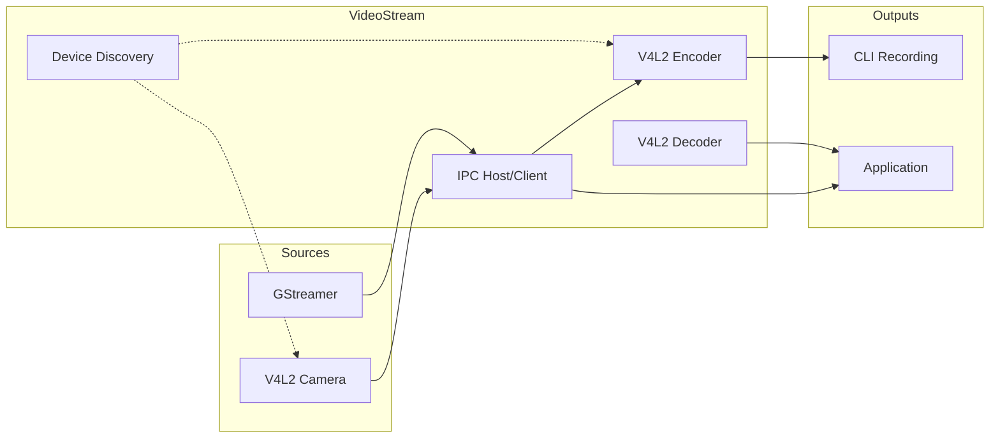

---

## System Architecture

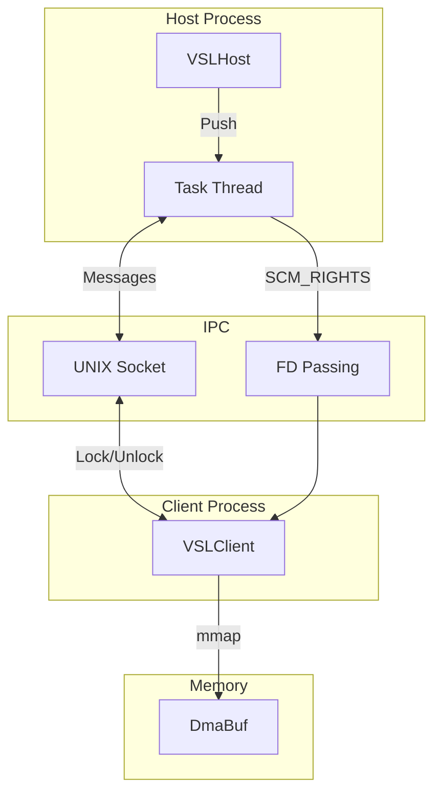

### Components

| Component | Role |
|-----------|------|
| **VSLHost** | Frame pool, client servicing, FD passing |
| **VSLClient** | Connect, receive frames, lock/unlock |
| **VSLFrame** | Frame metadata and memory mapping |
| **vslsink** | GStreamer sink → IPC host |
| **vslsrc** | IPC client → GStreamer source |
| **VSLEncoder** | V4L2 hardware encoding |
| **VSLDecoder** | V4L2 hardware decoding |

### Threading

- **Host**: Main thread + task thread for client servicing
- **Client**: Main thread + optional timeout watchdog
- All IPC operations are thread-safe with mutex protection

---

## IPC Protocol

### Message Flow

| Message | Direction | Purpose |
|---------|-----------|---------|
| `FRAME_EVENT` | Host → Client | New frame available |
| `LOCK_REQUEST` | Client → Host | Request frame access |
| `LOCK_RESPONSE` | Host → Client | Grant access with FD |
| `UNLOCK_REQUEST` | Client → Host | Release frame |

### Frame Lifecycle

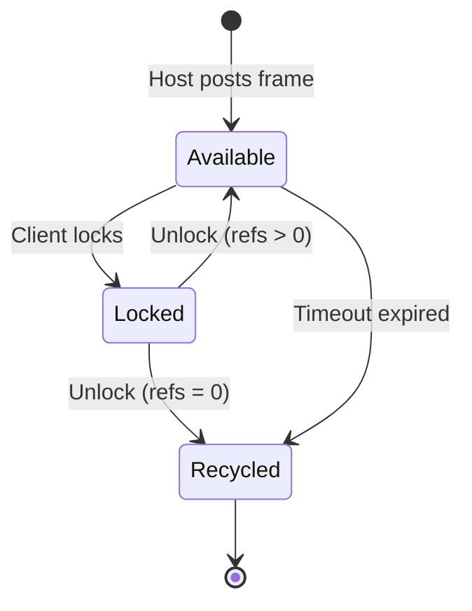

### Camera → IPC → Client Pipeline

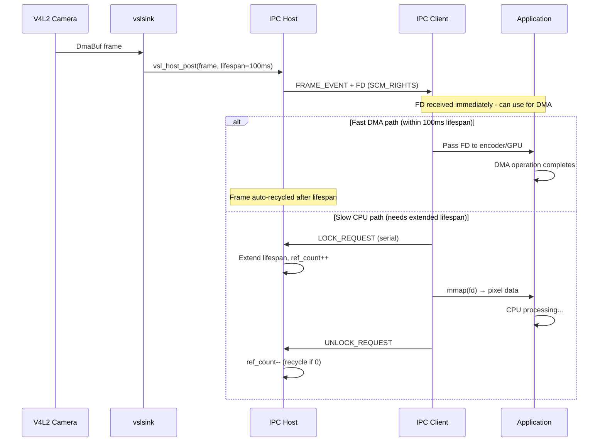

### Camera → Encode → File Pipeline

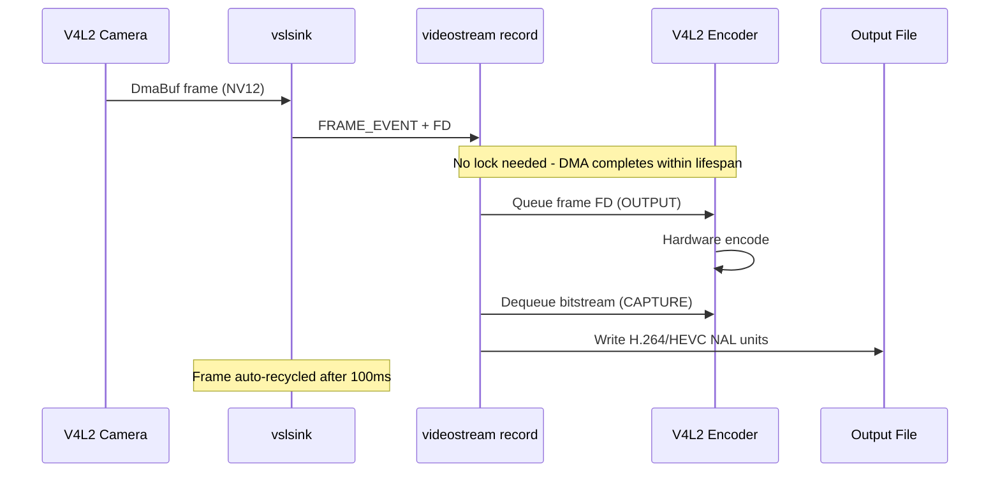

### Frame Lock Decision

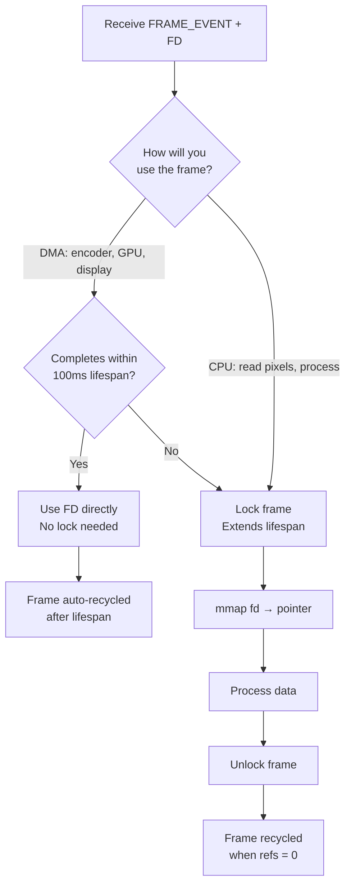

**Lock Guidelines:**

| Access Type | Lock Required | Why |
|-------------|---------------|-----|
| DMA to encoder | **No** | Hardware completes within 100ms lifespan |
| DMA to GPU | **No** | Hardware completes within 100ms lifespan |
| CPU read/write | **Yes** | Need stable mmap, CPU may be slow |
| ML inference | **Yes** | Processing time unpredictable |
| Multiple clients | **Yes** | Each client locks independently |

---

## GStreamer Integration

### Zero-Copy Flow

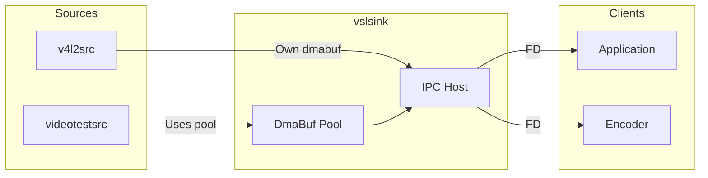

### Memory Handling

| Source | Memory | Copy Required |
|--------|--------|---------------|
| v4l2src (dmabuf) | DmaBuf | No |
| libcamerasrc (dmabuf) | DmaBuf | No |
| videotestsrc | Pool DmaBuf | No |
| Any (system memory) | Copy to pool | Yes |

### Properties

| Plugin | Property | Description |
|--------|----------|-------------|
| vslsink | `path` | UNIX socket path |
| vslsink | `lifespan` | Frame timeout (ms) |
| vslsink | `pool-size` | DmaBuf pool size |
| vslsrc | `path` | Socket to connect |
| vslsrc | `timeout` | Frame wait timeout |
| vslsrc | `reconnect` | Auto-reconnect |

---

## V4L2 Hardware

### Codec Architecture

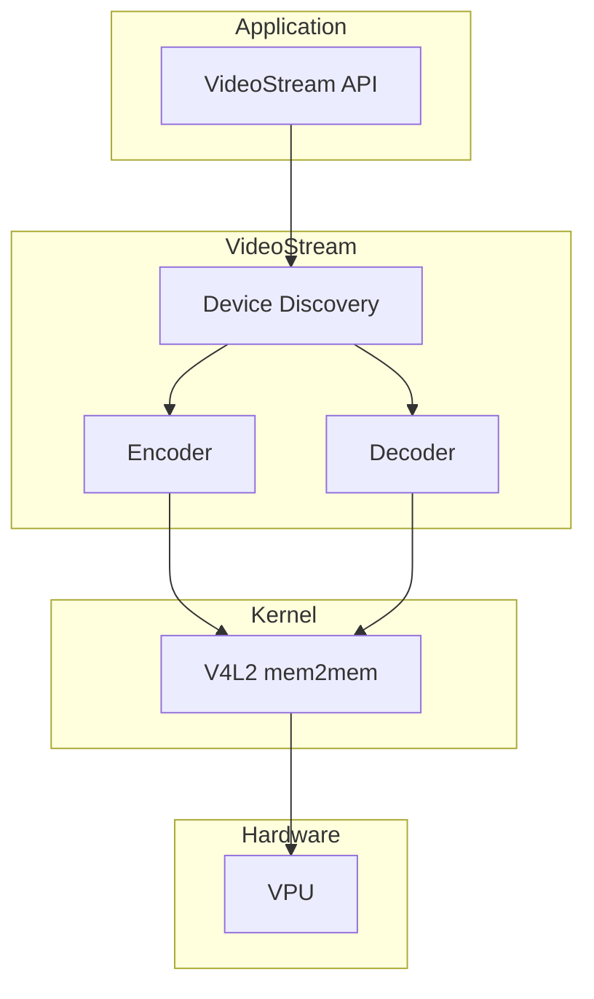

### Supported Codecs

| Codec | Encode | Decode |
|-------|--------|--------|
| H.264/AVC | ✓ | ✓ |
| H.265/HEVC | ✓ | ✓ |
| VP8 | - | ✓ |
| VP9 | - | ✓ |

### V4L2 mem2mem

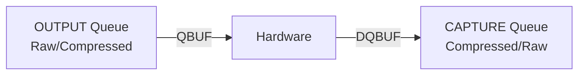

| Operation | OUTPUT | CAPTURE |
|-----------|--------|---------|
| Encode | Raw NV12/BGRA | H.264/HEVC |
| Decode | H.264/HEVC | Raw NV12 |

### Device Discovery

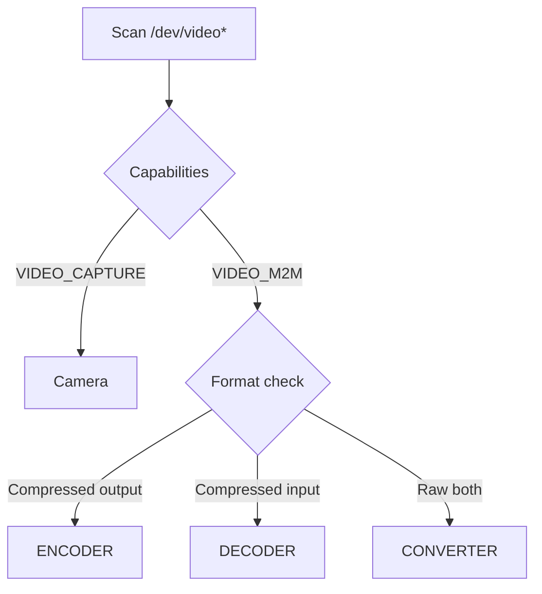

| Type | Description | Examples |
|------|-------------|----------|
| Camera | VIDEO_CAPTURE | mxc-isi, neoisp |
| Encoder | M2M, compressed out | wave6-enc, vsi_v4l2enc |
| Decoder | M2M, compressed in | wave6-dec, vsi_v4l2dec |
| Converter | M2M, raw both | mxc-isi-m2m |

### Platform Support

| Platform | Encoder | Decoder | Camera |
|----------|---------|---------|--------|
| i.MX 95 | wave6-enc | wave6-dec | mxc-isi-cap |
| i.MX 8M Plus | vsi_v4l2enc | vsi_v4l2dec | VIV |

---

## CLI Tool

### Architecture

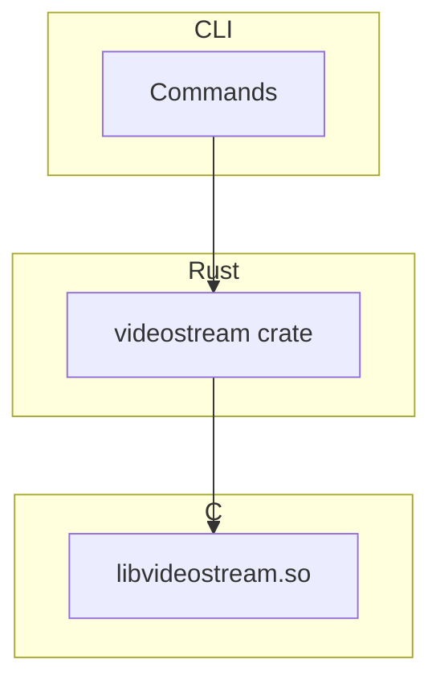

### Commands

| Command | Purpose |
|---------|---------|
| `stream` | Camera → IPC socket |
| `record` | Camera → H.264/H.265 file |
| `convert` | Annex B → MP4 |
| `devices` | V4L2 device discovery |
| `receive` | IPC → performance test |
| `info` | System capabilities |

---

## Example Pipelines

### Camera to IPC

```bash
# Terminal 1: Host
gst-launch-1.0 v4l2src ! vslsink path=/tmp/cam

# Terminal 2: Client
videostream receive --ipc /tmp/cam
```

### Camera to Recording

```bash
videostream record --device /dev/video0 --format NV12 \
    --encoder /dev/video10 -t 10 output.h264

videostream convert output.h264 output.mp4
```

### IPC to Encoding

```bash
# Terminal 1: Camera stream
gst-launch-1.0 libcamerasrc ! vslsink path=/tmp/vsl

# Terminal 2: Encode from IPC
videostream record --ipc /tmp/vsl --backend v4l2 -t 5 video.h264
```
