# VideoStream Library - Architecture Guide

**Version:** 2.3  
**Last Updated:** 2026-04-24

---

## Overview

VideoStream is a video I/O library for embedded Linux:

- **Zero-Copy IPC** - Share video frames between processes via DmaBuf
- **V4L2 Integration** - Camera capture, hardware codecs, device discovery
- **GStreamer Plugins** - `vslsink`/`vslsrc` elements
- **CLI Tool** - Streaming, recording, device enumeration
- **Rust Bindings** - Safe API with async support

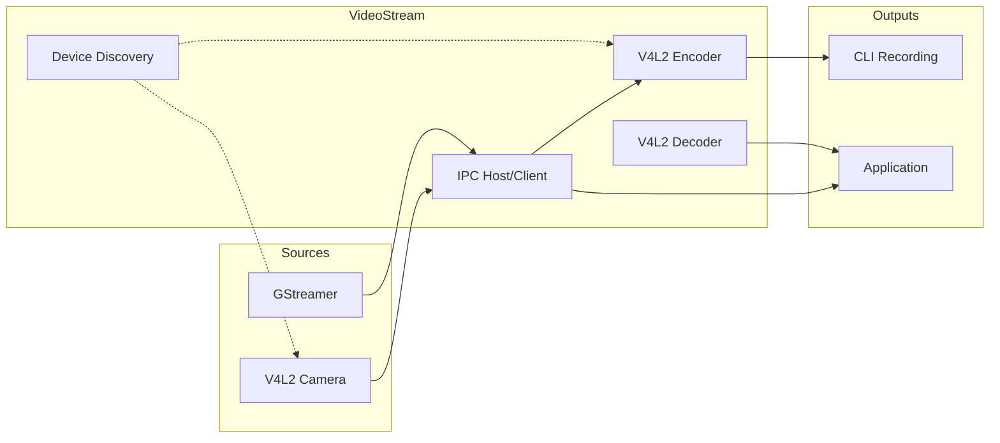
```mermaid
graph LR
    subgraph Sources
        CAM[V4L2 Camera]
        GST[GStreamer]
    end

    subgraph VideoStream
        IPC[IPC Host/Client]
        ENC[V4L2 Encoder]
        DEC[V4L2 Decoder]
        DISC[Device Discovery]
    end

    subgraph Outputs
        CLI[CLI Recording]
        APP[Application]
    end

    CAM --> IPC
    GST --> IPC
    IPC --> ENC --> CLI
    IPC --> APP
    DEC --> APP
    DISC -.-> CAM
    DISC -.-> ENC
```

---

## System Architecture

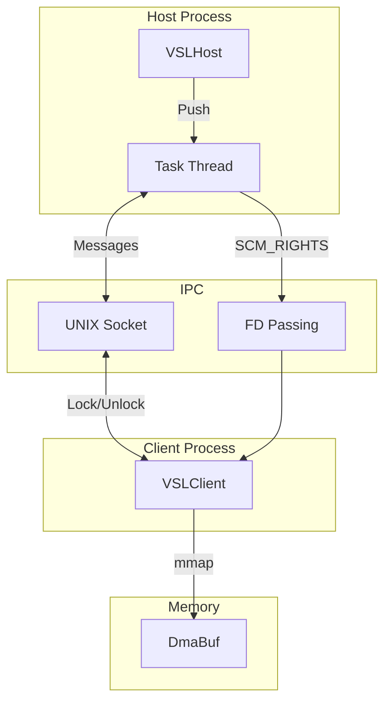
```mermaid
graph TB
    subgraph "Host Process"
        H[VSLHost]
        TS[Task Thread]
    end

    subgraph "Client Process"
        C[VSLClient]
    end

    subgraph "IPC"
        US[UNIX Socket]
        FD[FD Passing]
    end

    subgraph "Memory"
        DB[DmaBuf]
    end

    H -->|Push| TS
    TS <-->|Messages| US
    US <-->|Lock/Unlock| C
    TS -->|SCM_RIGHTS| FD
    FD --> C
    C -->|mmap| DB
```

### Components

| Component | Role |
|-----------|------|
| **VSLHost** | Frame pool, client servicing, FD passing |
| **VSLClient** | Connect, receive frames, lock/unlock |
| **VSLFrame** | Frame metadata and memory mapping |
| **vslsink** | GStreamer sink → IPC host |
| **vslsrc** | IPC client → GStreamer source |
| **VSLEncoder** | V4L2 hardware encoding |
| **VSLDecoder** | V4L2 hardware decoding |

### Threading

- **Host**: Main thread + task thread for client servicing
- **Client**: Main thread + optional timeout watchdog
- All IPC operations are thread-safe with mutex protection

---

## IPC Protocol

### Message Flow

| Message | Direction | Purpose |
|---------|-----------|---------|
| `FRAME_EVENT` | Host → Client | New frame available |
| `LOCK_REQUEST` | Client → Host | Request frame access |
| `LOCK_RESPONSE` | Host → Client | Grant access with FD |
| `UNLOCK_REQUEST` | Client → Host | Release frame |

### Frame Lifecycle

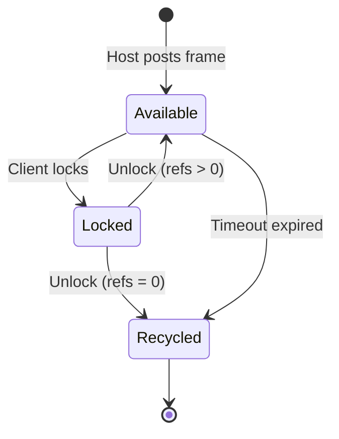
```mermaid
stateDiagram-v2
    [*] --> Available: Host posts frame
    Available --> Locked: Client locks
    Locked --> Available: Unlock (refs > 0)
    Locked --> Recycled: Unlock (refs = 0)
    Available --> Recycled: Timeout expired
    Recycled --> [*]
```

### Camera → IPC → Client Pipeline

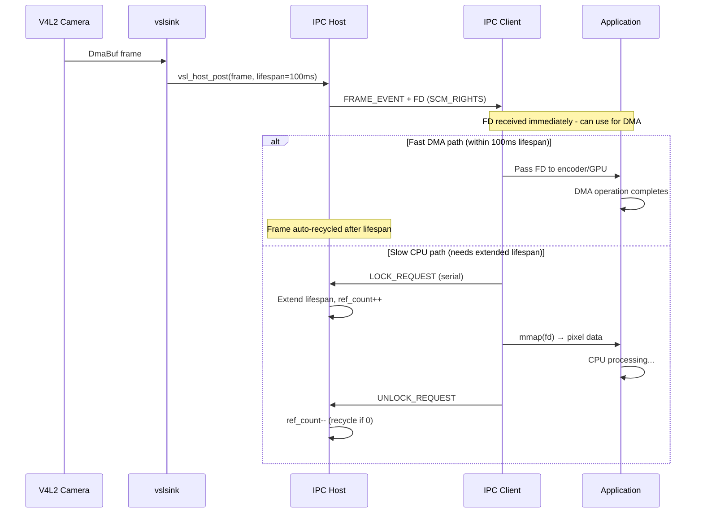
```mermaid
sequenceDiagram
    participant CAM as V4L2 Camera
    participant SINK as vslsink
    participant HOST as IPC Host
    participant CLIENT as IPC Client
    participant APP as Application

    CAM->>SINK: DmaBuf frame
    SINK->>HOST: vsl_host_post(frame, lifespan=100ms)
    HOST->>CLIENT: FRAME_EVENT + FD (SCM_RIGHTS)
    
    Note over CLIENT,APP: FD received immediately - can use for DMA
    
    alt Fast DMA path (within 100ms lifespan)
        CLIENT->>APP: Pass FD to encoder/GPU
        APP->>APP: DMA operation completes
        Note over HOST: Frame auto-recycled after lifespan
    else Slow CPU path (needs extended lifespan)
        CLIENT->>HOST: LOCK_REQUEST (serial)
        HOST->>HOST: Extend lifespan, ref_count++
        CLIENT->>APP: mmap(fd) → pixel data
        APP->>APP: CPU processing...
        CLIENT->>HOST: UNLOCK_REQUEST
        HOST->>HOST: ref_count-- (recycle if 0)
    end
```

### Camera → Encode → File Pipeline

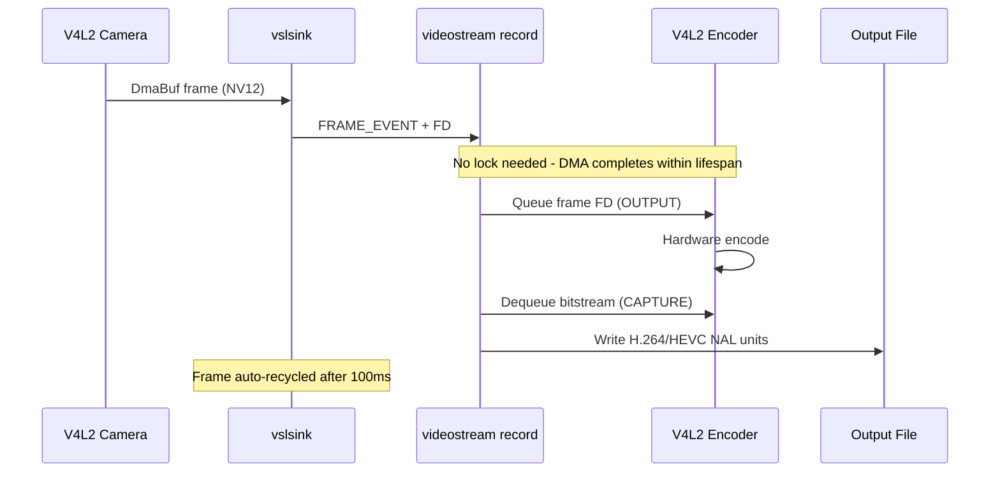
```mermaid
sequenceDiagram
    participant CAM as V4L2 Camera
    participant SINK as vslsink
    participant REC as videostream record
    participant ENC as V4L2 Encoder
    participant FILE as Output File

    CAM->>SINK: DmaBuf frame (NV12)
    SINK->>REC: FRAME_EVENT + FD
    
    Note over REC,ENC: No lock needed - DMA completes within lifespan
    
    REC->>ENC: Queue frame FD (OUTPUT)
    ENC->>ENC: Hardware encode
    REC->>ENC: Dequeue bitstream (CAPTURE)
    REC->>FILE: Write H.264/HEVC NAL units
    
    Note over SINK: Frame auto-recycled after 100ms
```

### Frame Lock Decision

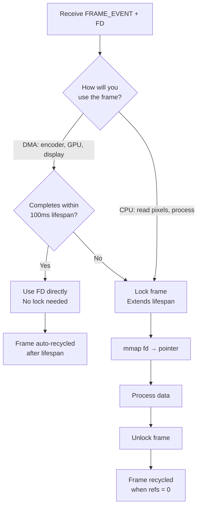
```mermaid
flowchart TD
    START[Receive FRAME_EVENT + FD] --> USE{How will you<br/>use the frame?}
    
    USE -->|DMA: encoder, GPU, display| FAST{Completes within<br/>100ms lifespan?}
    FAST -->|Yes| DIRECT[Use FD directly<br/>No lock needed]
    DIRECT --> AUTO[Frame auto-recycled<br/>after lifespan]
    
    FAST -->|No| LOCK
    USE -->|CPU: read pixels, process| LOCK[Lock frame<br/>Extends lifespan]
    LOCK --> MMAP[mmap fd → pointer]
    MMAP --> PROCESS[Process data]
    PROCESS --> UNLOCK[Unlock frame]
    UNLOCK --> RECYCLE[Frame recycled<br/>when refs = 0]
```

**Lock Guidelines:**

| Access Type | Lock Required | Why |
|-------------|---------------|-----|
| DMA to encoder | **No** | Hardware completes within 100ms lifespan |
| DMA to GPU | **No** | Hardware completes within 100ms lifespan |
| CPU read/write | **Yes** | Need stable mmap, CPU may be slow |
| ML inference | **Yes** | Processing time unpredictable |
| Multiple clients | **Yes** | Each client locks independently |

---

## GStreamer Integration

### Zero-Copy Flow

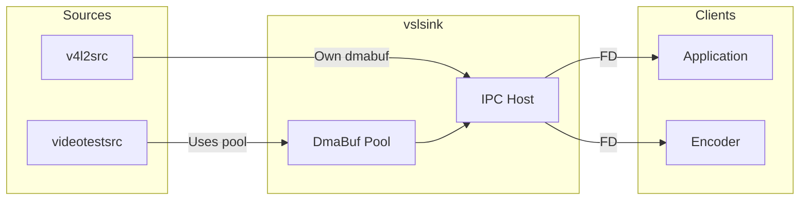
```mermaid
flowchart LR
    subgraph Sources
        VT[videotestsrc]
        V4L2[v4l2src]
    end

    subgraph vslsink
        POOL[DmaBuf Pool]
        IPC[IPC Host]
    end

    subgraph Clients
        APP[Application]
        ENC[Encoder]
    end

    VT -->|"Uses pool"| POOL
    V4L2 -->|"Own dmabuf"| IPC
    POOL --> IPC
    IPC -->|"FD"| APP
    IPC -->|"FD"| ENC
```

### Memory Handling

| Source | Memory | Copy Required |
|--------|--------|---------------|
| v4l2src (dmabuf) | DmaBuf | No |
| libcamerasrc (dmabuf) | DmaBuf | No |
| videotestsrc | Pool DmaBuf | No |
| Any (system memory) | Copy to pool | Yes |

### Properties

| Plugin | Property | Description |
|--------|----------|-------------|
| vslsink | `path` | UNIX socket path |
| vslsink | `lifespan` | Frame timeout (ms) |
| vslsink | `pool-size` | DmaBuf pool size |
| vslsrc | `path` | Socket to connect |
| vslsrc | `timeout` | Frame wait timeout |
| vslsrc | `reconnect` | Auto-reconnect |

---

## V4L2 Codec Implementation

### Overview

The V4L2 codec backend uses the Linux kernel's V4L2 mem2mem interface to access
VPU hardware through a portable, high-performance path. It replaces the legacy
Hantro user-space codec (libcodec.so) as the primary encode/decode backend.

**Motivation:**

- **Performance**: V4L2 decoder is 37–56× faster than libcodec.so across all resolutions
- **Stability**: libcodec.so encoder crashes with SIGSEGV; V4L2 encoder is stable
- **Portability**: V4L2 is a standard Linux API — no proprietary binary blobs
- **Zero-copy**: V4L2 DMABUF support enables efficient buffer sharing

The implementation supports two mutually exclusive V4L2 API variants:

| Platform | VPU | V4L2 Capability | Buffer Types |
|----------|-----|----------------|--------------|
| i.MX 8M Plus | Hantro VC8000E | `V4L2_CAP_VIDEO_M2M` | `VIDEO_OUTPUT` / `VIDEO_CAPTURE` (single-plane) |
| i.MX 95 | Chips&Media Wave6 | `V4L2_CAP_VIDEO_M2M_MPLANE` | `VIDEO_OUTPUT_MPLANE` / `VIDEO_CAPTURE_MPLANE` |

The library auto-detects the capability at device open time via `VIDIOC_QUERYCAP`
and stores the resolved buffer types in the encoder/decoder struct. All subsequent
V4L2 operations use these stored types, branching on `multiplanar` where the
`v4l2_format` union members differ (`fmt.pix` vs `fmt.pix_mp`).

### Hardware Architecture

#### i.MX 8M Plus (Hantro VC8000E — Single-Plane M2M)

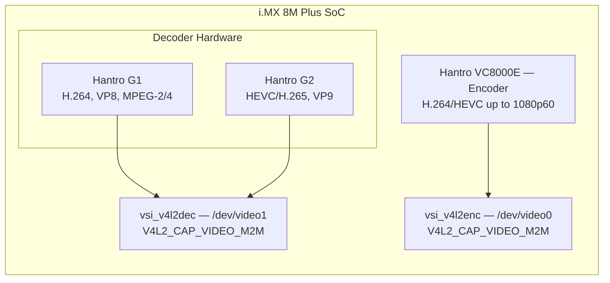
```mermaid
graph TD
    subgraph IMX8MP["i.MX 8M Plus SoC"]
        direction TB
        subgraph DEC_HW["Decoder Hardware"]
            G1["Hantro G1<br/>H.264, VP8, MPEG-2/4"]
            G2["Hantro G2<br/>HEVC/H.265, VP9"]
        end
        DEC_DRV["vsi_v4l2dec — /dev/video1<br/>V4L2_CAP_VIDEO_M2M"]

        ENC_HW["Hantro VC8000E — Encoder<br/>H.264/HEVC up to 1080p60"]
        ENC_DRV["vsi_v4l2enc — /dev/video0<br/>V4L2_CAP_VIDEO_M2M"]
    end

    G1 --> DEC_DRV
    G2 --> DEC_DRV
    ENC_HW --> ENC_DRV
```

#### i.MX 95 (Chips&Media Wave6 — MPLANE M2M)

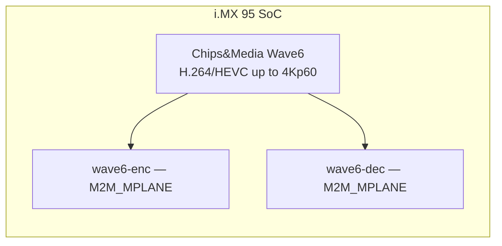
```mermaid
graph TD
    subgraph IMX95["i.MX 95 SoC"]
        direction TB
        WAVE6["Chips&Media Wave6<br/>H.264/HEVC up to 4Kp60"]
        ENC95["wave6-enc — M2M_MPLANE"]
        DEC95["wave6-dec — M2M_MPLANE"]
    end

    WAVE6 --> ENC95
    WAVE6 --> DEC95
```

#### Device Nodes

| Platform | Device | Driver | Function | Max Resolution | V4L2 API |
|----------|--------|--------|----------|----------------|----------|
| i.MX 8M Plus | `/dev/video0` | vsi_v4l2enc | H.264/HEVC Encoder | 1920×1080 @ 60fps | Single-plane M2M |
| i.MX 8M Plus | `/dev/video1` | vsi_v4l2dec | H.264/HEVC/VP9 Decoder | 4096×2160 @ 60fps | Single-plane M2M |
| i.MX 95 | auto-discovered | wave6-enc | H.264/HEVC Encoder | 4096×2160 @ 60fps | MPLANE M2M |
| i.MX 95 | auto-discovered | wave6-dec | H.264/HEVC Decoder | 4096×2160 @ 60fps | MPLANE M2M |

> **Note:** Hardware codec capability may exceed the set of codecs currently
> exposed through the VideoStream API. See [Supported Codecs](#supported-codecs)
> for what the library supports today.

### Codec Architecture

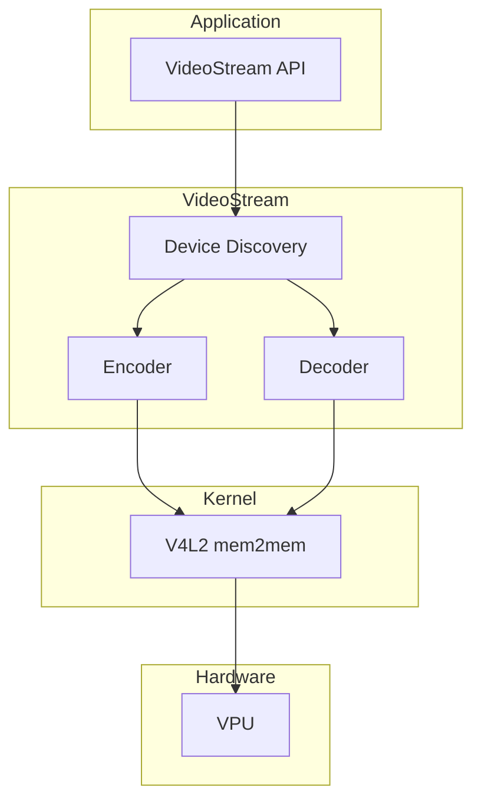
```mermaid
graph TB
    subgraph Application
        API[VideoStream API]
    end

    subgraph VideoStream
        DISC[Device Discovery]
        ENC[Encoder]
        DEC[Decoder]
    end

    subgraph Kernel
        M2M[V4L2 mem2mem]
    end

    subgraph Hardware
        VPU[VPU]
    end

    API --> DISC --> ENC & DEC
    ENC & DEC --> M2M --> VPU
```

### Supported Codecs

| Codec | Encode | Decode |
|-------|--------|--------|
| H.264/AVC | ✓ | ✓ |
| H.265/HEVC | ✓ | ✓ |
| VP8 | - | ✓ |
| VP9 | - | ✓ |

### V4L2 mem2mem

V4L2 mem2mem (memory-to-memory) is a kernel framework for hardware codecs that
process data from one buffer queue to another:


```mermaid
flowchart LR
    IN[Source Data] --> OUT[OUTPUT Queue]
    subgraph Device["V4L2 mem2mem Device"]
        OUT -->|Hardware| CAP[CAPTURE Queue]
    end
    CAP --> RESULT[Result Data]
```

| Operation | OUTPUT | CAPTURE |
|-----------|--------|---------|
| Encode | Raw NV12/BGRA | H.264/HEVC |
| Decode | H.264/HEVC | Raw NV12 |

**Buffer flow:**

1. Application queues source buffer to OUTPUT (`VIDIOC_QBUF`)
2. Hardware processes data
3. Application dequeues result from CAPTURE (`VIDIOC_DQBUF`)
4. Application returns buffer to OUTPUT (`VIDIOC_QBUF`)

### MPLANE vs Single-Plane

The two V4L2 API variants are **mutually exclusive per device** — each device
advertises exactly one capability. Detection priority: check
`V4L2_CAP_VIDEO_M2M_MPLANE` first, then `V4L2_CAP_VIDEO_M2M`.

Key differences:

| Aspect | Single-Plane (M2M) | Multi-Plane (M2M_MPLANE) |
|--------|-------------------|-------------------------|
| Buffer types | `VIDEO_OUTPUT` / `VIDEO_CAPTURE` | `VIDEO_OUTPUT_MPLANE` / `VIDEO_CAPTURE_MPLANE` |
| Format union | `fmt.pix` | `fmt.pix_mp` |
| Buffer offset | `buf.m.offset` | `planes[0].m.mem_offset` |
| Buffer FD | `buf.m.fd` | `planes[0].m.fd` |
| Bytes used | `buf.bytesused` | `planes[0].bytesused` |
| `buf.length` meaning | Buffer size in bytes | Number of planes |

For MPLANE, the decoder forces contiguous NV12 with `num_planes=1` to avoid the
NV12M multi-plane format (multi-FD DMA-BUF import is not implemented).

### Device Discovery

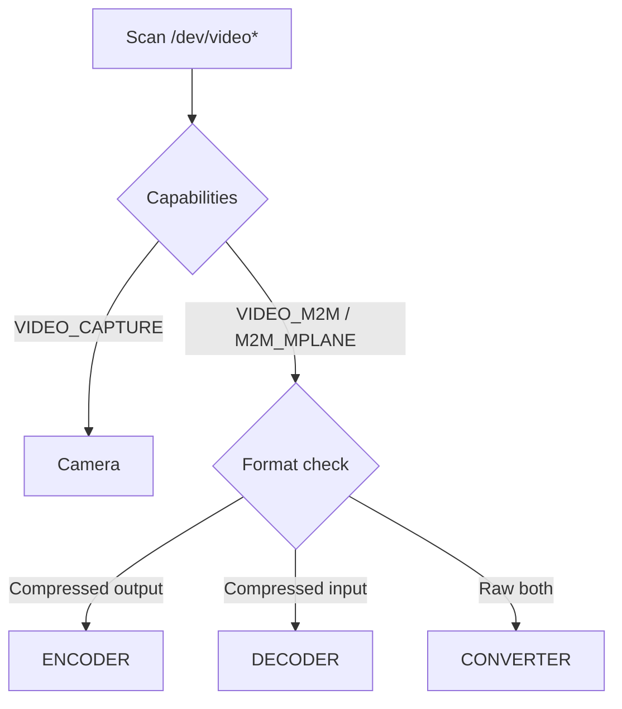
```mermaid
flowchart TD
    SCAN[Scan /dev/video*] --> CAP{Capabilities}
    CAP -->|VIDEO_CAPTURE| CAMERA[Camera]
    CAP -->|VIDEO_M2M / M2M_MPLANE| M2M{Format check}
    M2M -->|Compressed output| ENCODER
    M2M -->|Compressed input| DECODER
    M2M -->|Raw both| CONVERTER
```

| Type | Description | Examples |
|------|-------------|----------|
| Camera | VIDEO_CAPTURE | mxc-isi, neoisp |
| Encoder | M2M, compressed out | wave6-enc, vsi_v4l2enc |
| Decoder | M2M, compressed in | wave6-dec, vsi_v4l2dec |
| Converter | M2M, raw both | mxc-isi-m2m |

### Platform Support

| Platform | Encoder | Decoder | Camera | V4L2 API |
|----------|---------|---------|--------|----------|
| i.MX 95 | wave6-enc | wave6-dec | mxc-isi-cap | M2M_MPLANE |
| i.MX 8M Plus | vsi_v4l2enc | vsi_v4l2dec | VIV | M2M (single-plane) |

### Backend Selection

The library supports both V4L2 and Hantro backends with runtime selection and
automatic fallback.

> **Legacy Hantro backend:** The Hantro user-space codec (`libcodec.so` /
> `vpu_wrapper`) remains available as a fallback for older BSPs that lack V4L2
> M2M kernel drivers. On platforms with V4L2 support, the V4L2 backend is
> preferred due to its 37–56× decoder speedup and stable encoder.

#### Backend Enum

```c
typedef enum {
    VSL_CODEC_BACKEND_AUTO,     // Auto-detect best backend (default)
    VSL_CODEC_BACKEND_HANTRO,   // Force libcodec.so/vpu_wrapper
    VSL_CODEC_BACKEND_V4L2,     // Force V4L2 kernel driver
} VSLCodecBackend;
```

#### Extended API

```c
// Extended create functions with explicit backend selection
VSLDecoder* vsl_decoder_create_ex(uint32_t codec, int fps,
                                   VSLCodecBackend backend);
VSLEncoder* vsl_encoder_create_ex(VSLEncoderProfile profile,
                                   uint32_t codec, int fps,
                                   VSLCodecBackend backend);

// Original API uses AUTO backend (backwards compatible)
// vsl_decoder_create() calls vsl_decoder_create_ex(..., VSL_CODEC_BACKEND_AUTO)
```

#### Environment Variable Override

```bash
VSL_CODEC_BACKEND=hantro ./my_app   # Force Hantro even if V4L2 available
VSL_CODEC_BACKEND=v4l2 ./my_app     # Force V4L2 (fail if unavailable)
VSL_CODEC_BACKEND=auto ./my_app     # Auto-detect (default)
```

#### Auto-Detection Logic

```c
// Backend selection priority (for VSL_CODEC_BACKEND_AUTO):
//
// 1. Check VSL_CODEC_BACKEND environment variable
// 2. Scan /dev/video* for M2M devices matching requested codec
//    - Query VIDIOC_QUERYCAP on each device
//    - Accept V4L2_CAP_VIDEO_M2M or V4L2_CAP_VIDEO_M2M_MPLANE
//    - Prefer V4L2 if a matching device is found
// 3. Fallback to Hantro if V4L2 unavailable
//    - Check /dev/hantrodec or /dev/hantroenc
// 4. Return error if no backend available
```

#### Compile-Time Configuration

```cmake
option(ENABLE_V4L2_CODEC "Enable V4L2 codec backend" ON)
option(ENABLE_HANTRO_CODEC "Enable Hantro/libcodec.so backend" ON)

# At least one backend must be enabled
if(NOT ENABLE_V4L2_CODEC AND NOT ENABLE_HANTRO_CODEC)
    message(FATAL_ERROR "At least one codec backend must be enabled")
endif()
```

### Decoder Implementation

#### Data Structures

```c
typedef struct {
    int fd;                          // V4L2 device fd

    // Resolved buffer types (set at init from QUERYCAP)
    uint32_t output_type;            // VIDEO_OUTPUT or VIDEO_OUTPUT_MPLANE
    uint32_t capture_type;           // VIDEO_CAPTURE or VIDEO_CAPTURE_MPLANE
    bool multiplanar;                // true for M2M_MPLANE devices

    // OUTPUT queue (compressed data)
    struct {
        int count;
        size_t size;
        void *mmap[MAX_OUTPUT_BUFFERS];
        int queued[MAX_OUTPUT_BUFFERS];
    } output;

    // CAPTURE queue (decoded frames)
    struct {
        int count;
        int dmabuf_fds[MAX_CAPTURE_BUFFERS];
        VSLFrame *frames[MAX_CAPTURE_BUFFERS];
    } capture;

    int width, height;
    uint32_t pixelformat;
    bool streaming;
} VSLDecoderV4L2;
```

#### Initialization Sequence

```c
VSLDecoder* vsl_decoder_create_v4l2(uint32_t codec, int fps)
{
    // 1. Open device (auto-discovered by codec capability)
    int fd = open(dev_path, O_RDWR | O_NONBLOCK);

    // 2. Query capabilities and resolve buffer types
    struct v4l2_capability cap;
    ioctl(fd, VIDIOC_QUERYCAP, &cap);
    // Check V4L2_CAP_VIDEO_M2M_MPLANE first, then V4L2_CAP_VIDEO_M2M
    // Sets: dec->multiplanar, dec->output_type, dec->capture_type

    // 3. Set OUTPUT format (compressed bitstream)
    struct v4l2_format fmt = { .type = dec->output_type };
    if (dec->multiplanar) {
        fmt.fmt.pix_mp.pixelformat            = V4L2_PIX_FMT_H264;
        fmt.fmt.pix_mp.num_planes             = 1;
        fmt.fmt.pix_mp.plane_fmt[0].sizeimage = 2 * 1024 * 1024;
    } else {
        fmt.fmt.pix.pixelformat = V4L2_PIX_FMT_H264;
        fmt.fmt.pix.sizeimage   = 2 * 1024 * 1024;
    }
    ioctl(fd, VIDIOC_S_FMT, &fmt);

    // 4. Request OUTPUT buffers
    struct v4l2_requestbuffers req = {
        .count = NUM_OUTPUT_BUFFERS,
        .type = dec->output_type,
        .memory = V4L2_MEMORY_MMAP,
    };
    ioctl(fd, VIDIOC_REQBUFS, &req);

    // 5. Query and mmap OUTPUT buffers
    for (int i = 0; i < req.count; i++) {
        struct v4l2_buffer buf = { .type = dec->output_type, .index = i };
        struct v4l2_plane planes[1];
        if (dec->multiplanar) {
            buf.length = 1;
            buf.m.planes = planes;
        }
        ioctl(fd, VIDIOC_QUERYBUF, &buf);
        // mmap offset: planes[0].m.mem_offset (MPLANE) or buf.m.offset (single)
    }

    // CAPTURE queue setup deferred until resolution is known
    // (after first decoded frame or SOURCE_CHANGE event)
}
```

#### Decode Loop

```c
int vsl_decode_frame_v4l2(VSLDecoder *dec, const void *data,
                          unsigned int len, size_t *consumed,
                          VSLFrame **output)
{
    // 1. Find free OUTPUT buffer and copy compressed data
    int out_idx = find_free_output_buffer(dec);
    memcpy(dec->output.mmap[out_idx], data, len);

    // 2. Queue OUTPUT buffer
    struct v4l2_buffer buf = {
        .type = dec->output_type, .index = out_idx,
        .memory = V4L2_MEMORY_MMAP,
    };
    struct v4l2_plane planes[1];
    if (dec->multiplanar) {
        buf.length = 1;
        buf.m.planes = planes;
        planes[0].bytesused = len;
    } else {
        buf.bytesused = len;
    }
    ioctl(dec->fd, VIDIOC_QBUF, &buf);

    // 3. Start streaming if not already
    if (!dec->streaming) {
        int type = (int) dec->output_type;
        ioctl(dec->fd, VIDIOC_STREAMON, &type);
        type = (int) dec->capture_type;
        ioctl(dec->fd, VIDIOC_STREAMON, &type);
        dec->streaming = true;
    }

    // 4. Poll and dequeue CAPTURE buffer (decoded frame)
    struct v4l2_buffer cap_buf = {
        .type = dec->capture_type,
        .memory = V4L2_MEMORY_DMABUF,
    };
    struct v4l2_plane cap_planes[1];
    if (dec->multiplanar) {
        cap_buf.length = 1;
        cap_buf.m.planes = cap_planes;
    }
    if (ioctl(dec->fd, VIDIOC_DQBUF, &cap_buf) == 0) {
        *output = dec->capture.frames[cap_buf.index];
        *consumed = len;
        return VSL_DEC_FRAME_DEC;
    }
    return VSL_DEC_SUCCESS;
}
```

#### Resolution Change Handling

```c
// V4L2 SOURCE_CHANGE event indicates resolution/format change
void handle_source_change(VSLDecoderV4L2 *dec)
{
    // 1. Stop CAPTURE streaming
    int type = (int) dec->capture_type;
    ioctl(dec->fd, VIDIOC_STREAMOFF, &type);

    // 2. Read new format
    struct v4l2_format fmt = { .type = dec->capture_type };
    if (dec->multiplanar) {
        // Force contiguous NV12 (num_planes=1) to avoid multi-fd DMA-BUF
        fmt.fmt.pix_mp.pixelformat = V4L2_PIX_FMT_NV12;
        fmt.fmt.pix_mp.num_planes  = 1;
        ioctl(dec->fd, VIDIOC_S_FMT, &fmt);
        dec->width  = fmt.fmt.pix_mp.width;
        dec->height = fmt.fmt.pix_mp.height;
    } else {
        ioctl(dec->fd, VIDIOC_G_FMT, &fmt);
        dec->width  = fmt.fmt.pix.width;
        dec->height = fmt.fmt.pix.height;
    }

    // 3. Request new CAPTURE buffers with DMABUF
    struct v4l2_requestbuffers req = {
        .count = NUM_CAPTURE_BUFFERS,
        .type = dec->capture_type,
        .memory = V4L2_MEMORY_DMABUF,
    };
    ioctl(dec->fd, VIDIOC_REQBUFS, &req);

    // 4. Allocate DMA buffers and queue
    for (int i = 0; i < req.count; i++) {
        dec->capture.frames[i] = vsl_frame_alloc_dma(dec->width, dec->height);
        struct v4l2_buffer buf = {
            .type = dec->capture_type, .index = i,
            .memory = V4L2_MEMORY_DMABUF,
        };
        struct v4l2_plane planes[1];
        if (dec->multiplanar) {
            buf.length = 1;
            buf.m.planes = planes;
            planes[0].m.fd = vsl_frame_dma_fd(dec->capture.frames[i]);
        } else {
            buf.m.fd = vsl_frame_dma_fd(dec->capture.frames[i]);
        }
        ioctl(dec->fd, VIDIOC_QBUF, &buf);
    }

    // 5. Restart CAPTURE streaming
    ioctl(dec->fd, VIDIOC_STREAMON, &type);
}
```

### Encoder Implementation

#### Data Structures

```c
typedef struct {
    int fd;                          // V4L2 device fd

    // Resolved buffer types (set at init from QUERYCAP)
    uint32_t output_type;            // VIDEO_OUTPUT or VIDEO_OUTPUT_MPLANE
    uint32_t capture_type;           // VIDEO_CAPTURE or VIDEO_CAPTURE_MPLANE
    bool multiplanar;                // true for M2M_MPLANE devices
    int num_input_planes;            // 1 (contiguous NV12) or 2 (NV12M)

    // OUTPUT queue (raw frames)
    struct {
        int count;
        int dmabuf_fds[MAX_OUTPUT_BUFFERS];
    } output;

    // CAPTURE queue (compressed data)
    struct {
        int count;
        size_t size;
        void *mmap[MAX_CAPTURE_BUFFERS];
    } capture;

    int width, height, fps, bitrate, gop_size;

    // Crop region (for 4K tiling on VC8000E)
    struct { int x, y, w, h; } crop;
} VSLEncoderV4L2;
```

#### Initialization Sequence

```c
VSLEncoder* vsl_encoder_create_v4l2(uint32_t profile, uint32_t codec, int fps)
{
    // 1. Open device and query capabilities
    int fd = open(dev_path, O_RDWR | O_NONBLOCK);
    // Sets: enc->multiplanar, enc->output_type, enc->capture_type

    // 2. Set OUTPUT format (raw frames — NV12)
    struct v4l2_format fmt = { .type = enc->output_type };
    if (enc->multiplanar) {
        fmt.fmt.pix_mp.width       = width;
        fmt.fmt.pix_mp.height      = height;
        fmt.fmt.pix_mp.pixelformat = V4L2_PIX_FMT_NV12;
        fmt.fmt.pix_mp.num_planes  = 1;
    } else {
        fmt.fmt.pix.width       = width;
        fmt.fmt.pix.height      = height;
        fmt.fmt.pix.pixelformat = V4L2_PIX_FMT_NV12;
        fmt.fmt.pix.sizeimage   = width * height * 3 / 2;
    }
    ioctl(fd, VIDIOC_S_FMT, &fmt);

    // 3. Set CAPTURE format (compressed bitstream)
    memset(&fmt, 0, sizeof(fmt));
    fmt.type = enc->capture_type;
    if (enc->multiplanar) {
        fmt.fmt.pix_mp.pixelformat            = V4L2_PIX_FMT_H264;
        fmt.fmt.pix_mp.num_planes             = 1;
        fmt.fmt.pix_mp.plane_fmt[0].sizeimage = 2 * 1024 * 1024;
    } else {
        fmt.fmt.pix.pixelformat = V4L2_PIX_FMT_H264;
        fmt.fmt.pix.sizeimage   = 2 * 1024 * 1024;
    }
    ioctl(fd, VIDIOC_S_FMT, &fmt);

    // 4. Set encoder controls (bitrate, GOP, profile, level)
    // 5. Set crop region if needed (4K tiling on VC8000E)
    // 6. Request buffers (DMABUF for input, MMAP for output)
}
```

#### Encode Frame

```c
int vsl_encode_frame_v4l2(VSLEncoder *enc, const VSLFrame *input,
                          VSLFrame *output, int *keyframe)
{
    // 1. Queue input frame (DMABUF)
    struct v4l2_buffer buf = {
        .type = enc->output_type,
        .index = find_free_buffer(),
        .memory = V4L2_MEMORY_DMABUF,
    };
    struct v4l2_plane planes[2];
    if (enc->multiplanar) {
        buf.length = enc->num_input_planes;
        buf.m.planes = planes;
        planes[0].m.fd = vsl_frame_dma_fd(input);
        planes[0].bytesused = vsl_frame_size(input);
    } else {
        buf.m.fd      = vsl_frame_dma_fd(input);
        buf.bytesused = vsl_frame_size(input);
    }
    ioctl(enc->fd, VIDIOC_QBUF, &buf);

    // 2. Queue output buffer (MMAP) and poll for completion
    // ...

    // 3. Dequeue compressed output
    ioctl(enc->fd, VIDIOC_DQBUF, &out_buf);
    size_t encoded_size = enc->multiplanar
        ? cap_planes[0].bytesused : out_buf.bytesused;
    memcpy(vsl_frame_data(output), enc->capture.mmap[out_buf.index],
           encoded_size);

    // 4. Check keyframe flag
    *keyframe = (out_buf.flags & V4L2_BUF_FLAG_KEYFRAME) != 0;

    return encoded_size;
}
```

### 4K Tiling (i.MX 8M Plus / VC8000E)

> **Platform scope:** 4K tiling is only required on the i.MX 8M Plus where the
> Hantro VC8000E encoder supports a maximum of 1920×1080. On the i.MX 95, the
> Wave6 VPU handles up to 4Kp60 natively — no tiling needed.

For 4K content on VC8000E, the application splits the source into tiles:

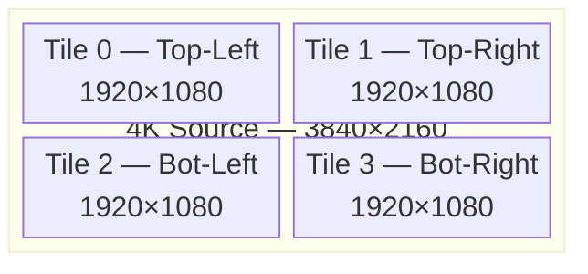
```mermaid
block-beta
    columns 2
    block:SRC["4K Source — 3840×2160"]:2
        columns 2
        T0["Tile 0 — Top-Left\n1920×1080"]
        T1["Tile 1 — Top-Right\n1920×1080"]
        T2["Tile 2 — Bot-Left\n1920×1080"]
        T3["Tile 3 — Bot-Right\n1920×1080"]
    end
```

Each tile uses the V4L2 selection API to set its crop region:

```c
struct v4l2_selection sel = {
    .type = enc->output_type,   // Resolved at init time
    .target = V4L2_SEL_TGT_CROP,
    .r = { .left = crop_x, .top = crop_y,
           .width = 1920, .height = 1080 }
};
ioctl(enc->fd, VIDIOC_S_SELECTION, &sel);
```

### Performance Benchmarks

Measured on i.MX 8M Plus (2025-01-01), 300 frames, H.264 Main Profile.

#### Decoder

| Resolution | libcodec.so | V4L2 | Improvement |
|------------|-------------|------|-------------|
| 640×480 | 34.00 ms | 0.82 ms | **41× faster** |
| 1280×720 | 111.00 ms | 1.97 ms | **56× faster** |
| 1920×1080 | 151.00 ms | 4.12 ms | **37× faster** |

#### Encoder

| Resolution | libcodec.so | V4L2 | Notes |
|------------|-------------|------|-------|
| 640×480 | SIGSEGV | 5.10 ms | V4L2 stable |
| 1280×720 | SIGSEGV | 12.70 ms | V4L2 stable |
| 1920×1080 | SIGSEGV | 27.50 ms (H.264) | ~36 fps capability |
| 1920×1080 | N/A | 27.77 ms (HEVC) | HEVC comparable |

#### Buffer Management Strategy

| Queue | Count | Content |
|-------|-------|---------|
| OUTPUT | 2–4 buffers | Compressed data or raw frames |
| CAPTURE | 4–8 buffers | Decoded frames or compressed output |

| Memory Type | Description |
|-------------|-------------|
| `V4L2_MEMORY_MMAP` | Driver-allocated, good for compressed data |
| `V4L2_MEMORY_DMABUF` | External DMA buffers, zero-copy sharing |

### V4L2 Control IDs

**Decoder:**

```c
V4L2_CID_MPEG_VIDEO_DEC_DISPLAY_DELAY
V4L2_CID_MPEG_VIDEO_DEC_DISPLAY_DELAY_ENABLE
```

**Encoder:**

```c
V4L2_CID_MPEG_VIDEO_BITRATE
V4L2_CID_MPEG_VIDEO_GOP_SIZE
V4L2_CID_MPEG_VIDEO_H264_PROFILE
V4L2_CID_MPEG_VIDEO_H264_LEVEL
V4L2_CID_MPEG_VIDEO_H264_I_FRAME_QP
V4L2_CID_MPEG_VIDEO_H264_P_FRAME_QP
V4L2_CID_MPEG_VIDEO_H264_B_FRAME_QP
V4L2_CID_MPEG_VIDEO_FORCE_KEY_FRAME
V4L2_CID_MPEG_VIDEO_H264_CPB_SIZE
V4L2_CID_MPEG_VIDEO_H264_VUI_SAR_ENABLE
```

### References

1. [V4L2 Stateful Decoder Interface](https://www.kernel.org/doc/html/latest/userspace-api/media/v4l/dev-decoder.html)
2. [V4L2 Stateful Encoder Interface](https://www.kernel.org/doc/html/latest/userspace-api/media/v4l/dev-encoder.html)
3. [V4L2 DMABUF](https://www.kernel.org/doc/html/latest/userspace-api/media/v4l/dmabuf.html)
4. [NXP i.MX 8M Plus Reference Manual](https://www.nxp.com/docs/en/reference-manual/IMX8MPRM.pdf)

---

## CLI Tool

### Architecture

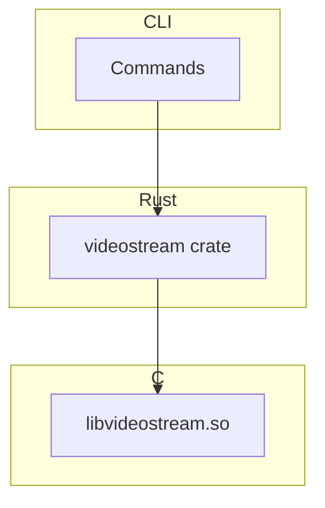
```mermaid
graph TB
    subgraph CLI
        CMD[Commands]
    end

    subgraph Rust
        BIND[videostream crate]
    end

    subgraph C
        LIB[libvideostream.so]
    end

    CMD --> BIND --> LIB
```

### Commands

| Command | Purpose |
|---------|---------|
| `stream` | Camera → IPC socket |
| `record` | Camera → H.264/H.265 file |
| `convert` | Annex B → MP4 |
| `devices` | V4L2 device discovery |
| `receive` | IPC → performance test |
| `info` | System capabilities |

---

## Example Pipelines

### Camera to IPC

```bash
# Terminal 1: Host
gst-launch-1.0 v4l2src ! vslsink path=/tmp/cam

# Terminal 2: Client
videostream receive --ipc /tmp/cam
```

### Camera to Recording

```bash
videostream record --device /dev/video0 --format NV12 \
    --encoder /dev/video10 -t 10 output.h264

videostream convert output.h264 output.mp4
```

### IPC to Encoding

```bash
# Terminal 1: Camera stream
gst-launch-1.0 libcamerasrc ! vslsink path=/tmp/vsl

# Terminal 2: Encode from IPC
videostream record --ipc /tmp/vsl --backend v4l2 -t 5 video.h264
```
