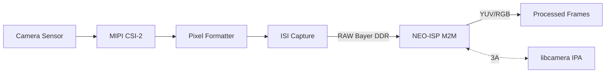

# Hardware Compatibility Catalog

This document catalogs tested hardware configurations for VideoStream.

## NXP i.MX 8M Plus

**Architecture:** Cortex-A53 (quad) + Cortex-M7  
**Codec:** Hantro VC8000E (H.264/HEVC encode/decode)  
**Accelerators:** G2D (GPU-based), ISI, MIPI-CSI2

### Tested Boards

| Board | Kernel | Status |
|-------|--------|--------|
| i.MX 8M Plus EVK | 6.12.34 | ✓ Tested |
| Au-Zone Maivin (Verdin i.MX 8M Plus) | 5.15.183-rt | ✓ Tested |

### V4L2 Codec Devices

| Driver | Function | Codecs |
|--------|----------|--------|
| vsi_v4l2enc | Encoder | H.264, HEVC |
| vsi_v4l2dec | Decoder | H.264, HEVC |
| mxc-jpeg | JPEG | Encode/Decode |

**Note:** The Hantro backend also exposes a proprietary API via `/dev/mxc_hantro*`. VideoStream supports both the V4L2 and Hantro backends on this platform.

### Cameras

#### OV5640 (OmniVision 5MP)

**Tested on:** i.MX 8M Plus EVK  
**Interface:** MIPI-CSI2  
**Pipeline:** OV5640 (integrated ISP) → mxc-mipi-csi2 → mxc_isi → /dev/video*

**Supported Resolutions:**

| Resolution | Aspect | 15fps | 30fps | 60fps |
|------------|--------|-------|-------|-------|
| 160x120 | 4:3 | ✓ | ✓ | ✗ |
| 176x144 | 11:9 | ✓ | ✓ | ✗ |
| 320x240 | 4:3 | ✓ | ✓ | ✗ |
| 640x360 | 16:9 | ✓ | ✓ | ✗ |
| 640x480 | 4:3 | ✓ | ✓ | ✓ |
| 720x480 | 3:2 | ✓ | ✓ | ✗ |
| 720x576 | 5:4 | ✓ | ✓ | ✗ |
| 1024x768 | 4:3 | ✓ | ✓ | ✗ |
| 1280x720 | 16:9 | ✓ | ✓ | ✗ |
| 1920x1080 | 16:9 | ✓ | ✓ | ✗ |
| 2592x1944 | 4:3 | ✓ | ✗ | ✗ |

**Supported Formats:** RGBP, RGB3, BGR3, YUYV, YUV4, NV12, NM12, YM24, XR24, AR24

**Notes:**
- Only 640x480 supports 60fps
- 2592x1944 (5MP) limited to 15fps
- Non-native resolutions (800x600, 960x540, 1280x960, 1600x1200) fail at STREAMON
- DMABUF export supported

#### OS08A20 (OmniVision 8MP)

**Tested on:** Au-Zone Maivin (Verdin i.MX 8M Plus)  
**Interface:** MIPI-CSI2  
**Pipeline:** OS08A20 → mxc-mipi-csi2 → mxc_isi → VeriSilicon ISP (viv_v4l2_device) → /dev/video3

**Supported Resolutions:**

| Resolution | Aspect | 30fps | Notes |
|------------|--------|-------|-------|
| 640x360 | 16:9 | ✓ | |
| 640x480 | 4:3 | ✓ | |
| 800x600 | 4:3 | ✓ | |
| 1024x768 | 4:3 | ✓ | |
| 1280x720 | 16:9 | ✓ | 720p HD |
| 1280x960 | 4:3 | ✓ | |
| 1600x1200 | 4:3 | ✓ | |
| 1920x1080 | 16:9 | ✓ | 1080p Full HD |
| 2048x1536 | 4:3 | ✓ | |
| 2560x1440 | 16:9 | ✓ | 1440p QHD |
| 2592x1944 | 4:3 | ✓ | 5MP |
| 3840x2160 | 16:9 | ✓ | 4K UHD |

**Supported Formats:** YUYV, NV12, NV16, BG12 (RAW Bayer)

**Notes:**
- Native sensor resolution: 3840x2160 (cropped from 8MP sensor)
- Stepwise resolution support: 176x144 to 4096x3072 (step 16x8)
- 960x540 adjusts to 960x544 (8-pixel height alignment)
- RAW Bayer (BG12) available on /dev/video3 only
- VeriSilicon ISP provides debayering, format conversion, and scaling

**Sensor Modes (from `sensor.query`):**

| Mode | Resolution | FPS | Bit Depth | HDR |
|------|------------|-----|-----------|-----|
| 0 | 1920x1080 | 60 | 10-bit | No |
| 1 | 1920x1080 | 30 | 10-bit | Yes |
| 2 | 3840x2160 | 30 | 12-bit | No (default) |
| 3 | 3840x2160 | 30 | 10-bit | Yes |

**VeriSilicon ISP JSON Control:**
- Custom ioctl via `V4L2_CID_VIV_EXTCTRL` (0x98f901)
- Commands use JSON format: `{"id":"command.name", ...}`
- Mirror/flip: `dwe.s.hflip`, `dwe.s.vflip`, `dwe.g.hflip`, `dwe.g.vflip`
- Sensor query: `sensor.query` (returns all modes with fps, resolution, bit depth)
- Mode switch: `sensor.s.mode` (must stop stream first)
- AE/AWB: `ae.g.cfg`, `ae.s.cfg`, `awb.g.cfg`, `awb.s.cfg`
- See i.MX 8M Plus Camera and Display Guide for full command list

## NXP i.MX 95

**Architecture:** Cortex-A55 (hex) + Cortex-M33 + Cortex-M7  
**Codec:** Chips&Media Wave6 (H.264/HEVC encode/decode via V4L2)  
**Accelerators:** G2D (DPU-based), ISI M2M scaler, PXP, OpenCL, JPEG codec

### Tested Boards

| Board | Kernel | Status |
|-------|--------|--------|
| i.MX 95 19x19 EVK | 6.12.49 | ✓ Camera + Codec tested |
| i.MX 95 FRDM | 6.12.49 | ✓ Codec tested |
| i.MX 95 15x15 EVK | 6.12.49 | — Documented |
| i.MX 95 Verdin | 6.12.49 | — Documented |

### V4L2 Codec Devices

| Driver | Function | Codecs | Memory |
|--------|----------|--------|--------|
| wave6-enc | Encoder | H.264, HEVC | MMAP, DMABUF |
| wave6-dec | Decoder | H.264, HEVC | MMAP, DMABUF |
| mxc-jpeg (enc) | JPEG Encoder | JPEG | MMAP, DMABUF |
| mxc-jpeg (dec) | JPEG Decoder | JPEG | MMAP, DMABUF |

Device paths vary across boots. VideoStream discovers devices by probing driver name and V4L2 capabilities rather than hardcoding paths.

**Encoder Input Formats:** NV12, NV21, NV16, NV61, YUYV, YU12, 422P, P010, RGB3, BGR3, ARGB, RGBA, BGRA, XRGB, and more.

**Encoder Controls:**
- Bitrate: 1–240 Mbps (default 2 Mbps), CBR/VBR
- GOP size: 0–2047 (default 30)
- H.264 profiles: Baseline, Main, High
- HEVC profiles: Main, Main 10
- QP control, entropy mode (CAVLC/CABAC), loop filter, 8x8 transform
- Flip, rotation (0–270°), force keyframe

### Scaling and Format Conversion

| Accelerator | Algorithm | Direction | Notes |
|-------------|-----------|-----------|-------|
| ISI M2M | Polyphase filter | Downscale only | No Bayer input; post-ISP scaling |
| G2D (DPU) | Bilinear | Up/Downscale | Rotation, CSC, composition |
| OpenCL (Mali GPU) | Configurable | Up/Downscale | Dewarp support |
| VPU | Built-in | Decode output | Decoder output only |

NEO-ISP has **no scaler** — use ISI M2M or G2D for post-ISP scaling.

**G2D on i.MX 95** is implemented via the DPU (Display Processing Unit), not a GPU:

| Feature | i.MX 8M Plus | i.MX 95 |
|---------|--------------|---------|
| G2D Backend | Vivante GPU | DPU V2 |
| Library | libg2d.so | libg2d-dpu.so |
| Hardware ID | `G2D_HARDWARE_2D` | `G2D_HARDWARE_DPU_V2` |

The G2D API (`g2d_blit`, `g2d_copy`, `g2d_buf_from_fd`) is identical across both platforms.

### Camera Subsystem

The i.MX 95 uses a fundamentally different camera architecture from i.MX 8M Plus:

| Feature | i.MX 8M Plus | i.MX 95 |
|---------|--------------|---------|
| ISP | VeriSilicon (inline) | NEO-ISP (M2M) |
| ISP API | Custom JSON over ioctl | V4L2 M2M + libcamera IPA |
| 3A Algorithms | ISP daemon | libcamera IPA module |
| Pipeline Management | Direct V4L2 | libcamera pipeline handler |
| CSI-2 | mxc-mipi-csi2 | dwc-mipi-csi2 (Synopsys DWC) |
| ISI | imx8-isi | imx95-isi (up to 8 channels) |



**libcamera is required** for RAW Bayer sensors on i.MX 95. The `nxp/neo` pipeline handler coordinates the ISI capture and NEO-ISP processing pipeline automatically.

```bash
# Required for RAW sensors — force NEO-ISP pipeline handler
export LIBCAMERA_PIPELINES_MATCH_LIST='nxp/neo,imx8-isi,simple'

# Debug logging
export LIBCAMERA_LOG_LEVELS='NxpNeo:DEBUG,ISI:DEBUG'
```

Without `LIBCAMERA_PIPELINES_MATCH_LIST`, the `imx8-isi` handler claims the camera first and only provides RAW Bayer output.

#### NEO-ISP V4L2 Topology

| Device | Type | Function |
|--------|------|----------|
| neoisp-input0 | video_output | RAW frame input |
| neoisp-input1 | video_output | Short exposure (HDR) |
| neoisp-params | meta_output | 3A parameters input |
| neoisp-frame | video_capture | Processed YUV/RGB output |
| neoisp-ir | video_capture | IR image output |
| neoisp-stats | meta_capture | 3A statistics output |

**Output Formats:** NV12, NV21, NV16, NV61, YUYV, UYVY, VYUY, YUV24, YUVX32, BGR24, RGB24, BGRX32, RGBX32, GREY, Y10, Y12, Y16

#### Device Tree Selection

Camera support requires sensor-specific DTB files:

| Camera | EVK 19x19 | EVK 15x15 | Verdin |
|--------|-----------|-----------|--------|
| OX03C10 (GMSL) | imx95-19x19-evk-ox03c10-isp-*.dtb | imx95-15x15-evk-ox03c10-isp-*.dtb | imx95-19x19-verdin-ox03c10-isp-*.dtb |
| OS08A20 | imx95-19x19-evk-os08a20-isp-*.dtb | imx95-15x15-evk-os08a20-isp-*.dtb | imx95-19x19-verdin-os08a20-isp-*.dtb |
| OX05B1S | imx95-19x19-evk-ox05b1s-isp-*.dtb | imx95-15x15-evk-ox05b1s-isp-*.dtb | imx95-19x19-verdin-ox05b1s-isp-*.dtb |
| AP1302 (smart) | imx95-19x19-evk-adv7535-ap1302.dtb | — | imx95-15x15-verdin-adv7535-ap1302.dtb |

Pre-built DTBs pair a camera with a specific display (LVDS or HDMI). For custom combinations (e.g. OS08A20 camera + HDMI display), merge overlays from the base DTB using `fdtoverlay`. See the [DTB Overlay Merging](#dtb-overlay-merging-imx-95-evk) section below.

#### MIPI Interface Architecture (19x19 EVK)

The EVK has two independent MIPI CSI-2 receive paths:

| Port | PHY | I2C Bus | Connector | Shared With |
|------|-----|---------|-----------|-------------|
| CSI0 | Dedicated D-PHY (`dphy_rx`) | lpi2c3 (I2C3) | J42 | Nothing (independent) |
| CSI1 | Combo PHY (`combo_rx`) | lpi2c2 (I2C2) | — | MIPI DSI display output |

Camera overlays named `*-combo.dtbo` use the CSI1 combo PHY and **disable DSI display output** (HDMI via ADV7535 or LVDS). Non-combo overlays (e.g. `os08a20.dtbo`) use the dedicated CSI0 port and are compatible with any display.

#### DTB Overlay Merging (i.MX 95 EVK)

The boot partition contains both pre-merged DTBs and individual `.dtbo` overlays. To create a custom camera+display configuration, merge the base DTB with the desired overlays:

```bash
# Example: OS08A20 camera + HDMI display + NEO-ISP
fdtoverlay \
    -i /run/media/boot-mmcblk0p1/imx95-19x19-evk.dtb \
    -o /run/media/boot-mmcblk0p1/imx95-19x19-evk-os08a20-isp-adv7535.dtb \
    /run/media/boot-mmcblk0p1/imx95-19x19-evk-adv7535.dtbo \
    /run/media/boot-mmcblk0p1/imx95-19x19-evk-os08a20.dtbo \
    /run/media/boot-mmcblk0p1/imx95-19x19-evk-neoisp.dtbo
```

Then set u-boot to load the new DTB (via serial console):

```
setenv fdtfile imx95-19x19-evk-os08a20-isp-adv7535.dtb
saveenv
boot
```

**Available overlays and their hardware targets:**

| Overlay | Targets | Conflicts |
|---------|---------|-----------|
| `adv7535.dtbo` | lpi2c2, mipi_dsi, DPU, pixel_interleaver | combo camera overlays |
| `os08a20.dtbo` | lpi2c3, dphy_rx, mipi_csi0, pixel_formatter_0 | other CSI0 cameras |
| `os08a20-combo.dtbo` | lpi2c2, combo_rx, mipi_csi1, pixel_formatter_1 | adv7535 (disables DSI) |
| `neoisp.dtbo` | neoisp0 | none |
| `ap1302.dtbo` | lpi2c3, dphy_rx, mipi_csi0, pixel_formatter_0 | other CSI0 cameras |
| `it6263-lvds0.dtbo` | LVDS0 display | none |

#### Supported Cameras

| Sensor | Type | Resolution | Features |
|--------|------|------------|----------|
| OX03C10 | RAW | 1920x1280 | 3-exposure HDR, 180° FOV, GMSL |
| OX05B1S | RAW | 2592x1944 | RGB-IR 4x4, 160° FOV |
| OS08A20 | RAW | 3840x2160 | 2-exposure HDR, 120-130° FOV |
| AP1302/AR0144 | Smart | 1280x800 | On-board ISP (YUV output, no NEO-ISP needed) |

#### Cameras Tested

##### OS08A20 (OmniVision 8MP) on i.MX 95 19x19 EVK

**Interface:** MIPI CSI-2 (4-lane)  
**DTB:** `imx95-19x19-evk-os08a20-isp-it6263-lvds0.dtb`

**Verified Performance:**

| Resolution | Format | Frame Rate | Status |
|------------|--------|------------|--------|
| 640x480 | NV12 (NeoISP) | 60 fps | ✓ |
| 1280x720 | NV12 (NeoISP) | 60 fps | ✓ |
| 1920x1080 | NV12 (NeoISP) | 60 fps | ✓ |
| 3840x2160 | NV12 (NeoISP) | 30 fps | ✓ |
| 1920x1080 | H.264 encode | 60 fps | ✓ |
| 3840x2160 | H.264 encode | 30 fps | ✓ |
| 1920x1080 | RAW Bayer (SBGGR10) | 60 fps | ✓ |
| 3840x2160 | RAW Bayer (SBGGR10) | 30 fps | ✓ |

30-second sustained capture (900+ frames) verified with zero drops.

**GStreamer Pipelines:**

```bash
export LIBCAMERA_PIPELINES_MATCH_LIST='nxp/neo,imx8-isi'

# Camera preview
gst-launch-1.0 libcamerasrc camera-name="${CAMERA0}" ! \
    video/x-raw,format=YUY2 ! waylandsink

# 1080p H.264 encode to MP4
gst-launch-1.0 libcamerasrc ! "video/x-raw,width=1920,height=1080" ! \
    identity eos-after=600 ! \
    v4l2h264enc extra-controls="controls,video_bitrate=8000000" ! \
    h264parse ! mp4mux ! filesink location=output.mp4

# 4K H.264 encode
gst-launch-1.0 libcamerasrc ! \
    v4l2h264enc extra-controls="controls,video_bitrate=15000000" ! \
    h264parse ! mp4mux ! filesink location=output_4k.mp4
```

**Camera identifiers:**

```bash
# OS08A20 on EVK 19x19
CAMERA0="/base/soc/bus@42000000/i2c@42530000/os08a20_mipi@36"

# OX05B1S on EVK 19x19
CAMERA0="/base/soc/bus@42000000/i2c@42530000/ox05b1s@36"

# AP1302 Smart Camera
CAMERA0="/base/soc/bus@42000000/i2c@42530000/ap1302_mipi@3c"
```

**Important:** Do NOT specify `format=NV12` in GStreamer caps — let auto-negotiation choose the format (usually NV21). Explicit format caps can cause negotiation failures.

#### Known Limitations

- OX03C10 may hang under heavy system load
- PipeWire service may conflict with OX03C10 — disable with `systemctl --user mask pipewire`
- NEO-ISP has no scaler; output resolution matches sensor native resolution
- NEO-ISP aligns height to 8 pixels (e.g. 1080 → 1088)

#### Future: libcamera Integration

VideoStream currently uses V4L2 directly for camera capture. On i.MX 95, the recommended path for production is libcamera integration, which provides:
- Automatic NEO-ISP pipeline management
- 3A algorithm support (AE, AWB, AF) via IPA modules
- Multi-camera coordination
- DmaBuf zero-copy frame delivery

## Legend

- ✓ = Tested and working
- ✗ = Tested and not working / not supported
- — = Not yet tested
