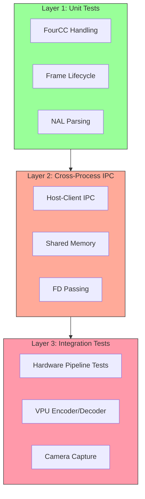
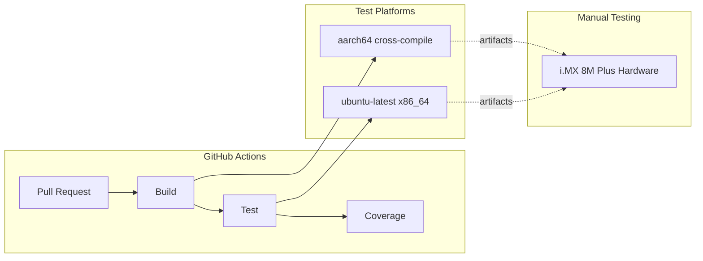
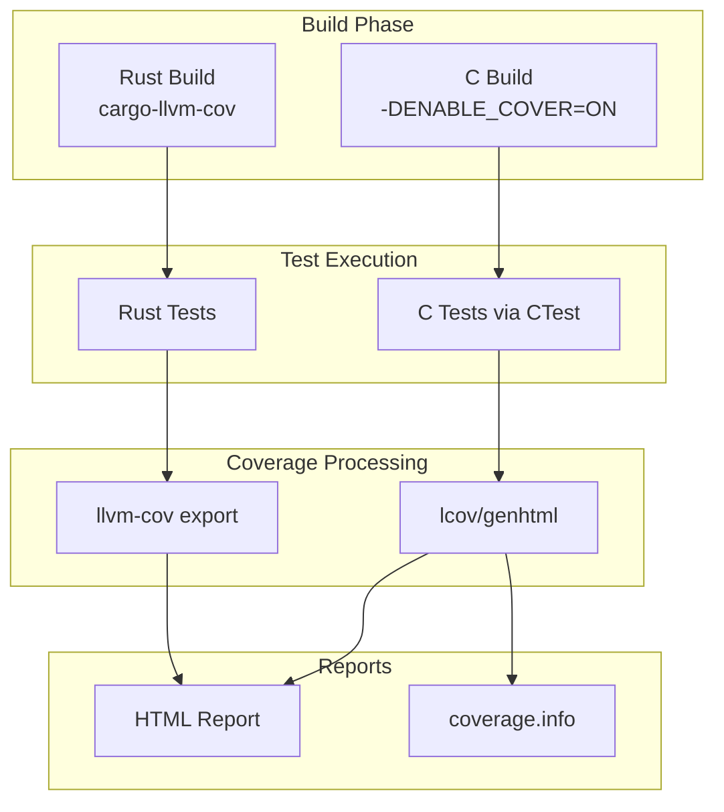

# VideoStream Testing Strategy

## Table of Contents

1. [Overview](#overview)
2. [Hardware Requirements](#hardware-requirements)
3. [Test Layers](#test-layers)
   - [Layer 1: Unit Tests](#layer-1-unit-tests-generic-platform)
   - [Layer 2: Cross-Process IPC Tests](#layer-2-cross-process-ipc-tests-generic-linux)
   - [Layer 3: Integration Tests](#layer-3-integration-tests-imx-8m-plus-hardware)
4. [GitHub Actions CI](#github-actions-ci)
5. [On-Target Testing](#on-target-testing-imx-8m-plus)
6. [Coverage Collection](#coverage-collection)
7. [Benchmark Reporting](#benchmark-reporting)
8. [Test Data](#test-data)
9. [Adding New Tests](#adding-new-tests)
10. [Troubleshooting Tests](#troubleshooting-tests)
11. [Summary](#summary)

---

## Overview

VideoStream employs a multi-layered testing approach spanning C, Rust, and Python codebases with platform-specific and hardware-specific test tiers.



**Testing Pyramid**:
1. **Unit Tests**: Fast, isolated, no hardware dependencies
2. **Cross-Process IPC Tests**: Multi-process with shared memory (generic Linux)
3. **Integration Tests**: Full pipeline with hardware (i.MX 8M Plus required)

---

## Hardware Requirements

| Test Category | Hardware Requirements | Notes |
|---------------|----------------------|-------|
| **Unit Tests** | Any Linux (x86_64, aarch64) | No hardware dependencies |
| **IPC Tests** | Any Linux with POSIX shared memory | No camera or VPU required |
| **VPU Encoder Tests** | NXP i.MX 8M Plus EVK or compatible | Hantro VC8000e encoder |
| **VPU Decoder Tests** | NXP i.MX 8M Plus EVK or compatible | Hantro VC8000d decoder |
| **Camera Tests** | i.MX 8M Plus with OV5640 or compatible | Camera on /dev/video3 |
| **DMA Heap Tests** | Kernel 5.10+ with CONFIG_DMABUF_HEAPS | /dev/dma_heap/linux,cma |

---

## Test Layers

### Layer 1: Unit Tests (Generic Platform)

**Purpose**: Validate isolated components without hardware dependencies.

**Technologies**: C (CTest), Rust (cargo test), Python (pytest)

**Coverage**:
- FourCC code handling and conversions
- Frame size calculations
- Annex B bitstream compliance (NAL parsing, SPS/PPS extraction)
- Memory allocation/deallocation
- Reference counting logic
- Timestamp calculations

**Examples**:
```bash
# C unit tests
cd build && ctest --output-on-failure

# Rust unit tests
cargo test --package videostream

# Python unit tests (when implemented)
pytest videostream/tests/
```

**Platforms**: x86_64, aarch64, any Linux

**CI**: GitHub Actions runs on ubuntu-latest (x86_64)

---

### Layer 2: Cross-Process IPC Tests (Generic Linux)

**Purpose**: Validate host-client communication using shared memory without hardware accelerators.

**Requirements**:
- Linux kernel with POSIX shared memory
- No camera, VPU, or i.MX-specific hardware

**What's Tested**:
- UNIX socket creation and communication
- File descriptor passing (`SCM_RIGHTS`)
- Frame metadata serialization
- Client connection/disconnection handling
- Frame expiration and recycling
- Multi-client scenarios

**Test Files**:
- `src/test_host.c` - Host functionality
- `src/test_client.c` - Client functionality
- `src/test_shm.c` - Shared memory allocation

**Run**:
```bash
cd build
./src/vsl-test-host &
./src/vsl-test-client
```

**Platforms**: Any Linux (x86_64, aarch64, Raspberry Pi, etc.)

**CI**: GitHub Actions ubuntu-latest

---

### Layer 3: Integration Tests (i.MX 8M Plus Hardware)

**Purpose**: Validate complete video pipeline with camera, VPU encoder/decoder, and DMA buffers.

**Requirements**:
- NXP i.MX 8M Plus EVK or compatible
- Camera connected to /dev/video3 (OV5640 or compatible)
- VPU: Hantro H1 encoder, G1/G2 decoder (via /dev/mxc_hantro* low-level API)
- DMA heap: /dev/dma_heap/linux,cma

**Pipeline Validated**:
```
Camera → VPU Encoder → Host → Client → VPU Decoder
        (H.264/HEVC)         (IPC)      (Raw NV12)
```

**Test Scenarios**:
1. **H.264 Encode Pipeline**: Camera (YUYV) → H.264 → Host → Client
2. **H.265 Encode Pipeline**: Camera (NV12) → HEVC → Host → Client
3. **Raw Frame Pipeline**: Camera (YUYV) → Host → Client (no encoding)
4. **Decode Pipeline**: H.264 bitstream → Decoder → NV12 frames

**Test File**: `crates/videostream/tests/integration_pipeline.rs`

**Run on Hardware**:
```bash
# Set library path (if not installed system-wide)
export LD_LIBRARY_PATH=/path/to/build:$LD_LIBRARY_PATH

# Run all hardware tests (--test-threads=1 ensures camera tests don't run concurrently)
cargo test --package videostream --test integration_pipeline -- --ignored --nocapture --test-threads=1

# Run specific test
cargo test test_camera_encode_h264_pipeline -- --ignored --nocapture --test-threads=1

# With debug logging
RUST_LOG=debug cargo test test_camera_encode_h264_pipeline -- --ignored --nocapture --test-threads=1
```

**Performance Validation**:
- Frame rate: ≥25 fps for encoded pipelines, ≥30 fps for raw
- Throughput: ~5 Mbps @ 5000 kbps H.264 bitrate
- Keyframe detection: ≥1 per 60 frames
- Drop rate: <5%

**Platforms**: i.MX 8M Plus only

**CI**: Not automated (requires physical hardware access)

#### VPU Decoder Behavior

The Hantro VPU decoder exhibits normal H.264 behavior with an **alternating frame pattern**:

**Characteristics**:
- **50% decode success rate**: Only every other `decode_frame()` call returns a frame
- **Pattern**: SFSFSFSF... (Success, Fail, Success, Fail...)
- **Latency**: Bimodal distribution
  - Buffered frames: 0-4ms (returns previously decoded frame)
  - Processing frames: 200-250ms (processes new input frame)

**Why This Happens**:
- H.264 uses inter-frame prediction (P/B frames depend on reference frames)
- VPU maintains internal buffer for reference frames
- Decoder pipeline: Accept frame N → Process internally → Return frame N on next call

**Example Flow**:
```
Call 1: decode_frame(frame_1) → Buffer internally, return NULL (~200ms)
Call 2: decode_frame(frame_2) → Return frame_1, buffer frame_2 (0-4ms)
Call 3: decode_frame(frame_3) → Return frame_2, buffer frame_3 (~200ms)
Call 4: decode_frame(frame_4) → Return frame_3, buffer frame_4 (0-4ms)
```

**Production Implications**:
- Applications must buffer/skip frames to compensate for alternating pattern
- Effective decode rate: 15 FPS from 30 FPS input (every other frame)
- Verify decoded output size = 1,382,400 bytes for 1280×720 NV12

**Validation**: Integration tests verify this behavior pattern programmatically.

---

## GitHub Actions CI



### Workflows

#### 1. Test Workflow (`.github/workflows/test.yml`)

**Platforms**: ubuntu-latest (x86_64)

**Jobs**:
- **C Build & Test**:
  ```bash
  cmake -S . -B build -DCMAKE_BUILD_TYPE=Debug -DENABLE_COVER=ON
  cmake --build build
  ctest --test-dir build --output-on-failure
  ```
- **Rust Unit Tests**:
  ```bash
  cargo test --workspace
  ```
- **Coverage Report**:
  ```bash
  lcov --capture --directory build --output-file coverage.info
  lcov --remove coverage.info '/usr/*' 'ext/*' --output-file coverage.info
  genhtml coverage.info --output-directory coverage
  ```

**Limitations**:
- No hardware tests (camera, VPU)
- POSIX shared memory tests only
- Code coverage available

#### 2. Build Workflow (`.github/workflows/build.yml`)

**Platforms**: ubuntu-latest with manylinux2014 (via zig toolchain)

**Jobs**:
- Cross-compile for aarch64 using zig
- Build Python wheels for multiple architectures
- Package relocatable archives (ZIP)

**Manylinux2014 Limitations**:
- **Purpose**: Release builds for maximum glibc compatibility (glibc 2.17+)
- **Not suitable for testing**: Older glibc lacks features used in test code
- **Test builds**: Use native toolchains (ubuntu-latest) instead
- **Release builds**: Use manylinux2014 for distribution

**Why separate test/build workflows**:
- **test.yml**: Uses ubuntu-latest with modern glibc for feature-rich test execution
- **build.yml**: Uses manylinux2014 for maximum runtime compatibility

---

## On-Target Testing (i.MX 8M Plus)

### Setup

**Target System**:
- NXP i.MX 8M Plus EVK
- Yocto Linux or Ubuntu 22.04+ for aarch64
- Camera: OV5640 on /dev/video3
- SSH access: root@10.10.40.182 (example)

**Build & Deploy**:
```bash
# Host: Cross-compile for aarch64
cmake -S . -B build-aarch64 \
  -DCMAKE_TOOLCHAIN_FILE=toolchain-aarch64.cmake \
  -DCMAKE_BUILD_TYPE=RelWithDebInfo \
  -DENABLE_GSTREAMER=OFF

cmake --build build-aarch64 -j$(nproc)

# Build Rust CLI and tests
CARGO_TARGET_AARCH64_UNKNOWN_LINUX_GNU_LINKER=aarch64-linux-gnu-gcc \
  LD_LIBRARY_PATH=$PWD/build-aarch64:$LD_LIBRARY_PATH \
  cargo build --release --target aarch64-unknown-linux-gnu

cargo test --package videostream --test integration_pipeline \
  --target aarch64-unknown-linux-gnu --no-run

# Deploy to target
scp build-aarch64/libvideostream.so.2.0.0 root@10.10.40.182:/tmp/vsl/lib/
scp target/aarch64-unknown-linux-gnu/release/videostream root@10.10.40.182:/tmp/vsl/bin/
scp target/aarch64-unknown-linux-gnu/debug/deps/integration_pipeline-* \
    root@10.10.40.182:/tmp/vsl/bin/integration_pipeline
```

### Running Tests

**On Target**:
```bash
ssh root@10.10.40.182

cd /tmp/vsl
export LD_LIBRARY_PATH=/tmp/vsl/lib:/usr/lib

# Verify devices
ls -la /dev/video* /dev/dma_heap/*

# Run integration tests (--test-threads=1 ensures camera tests don't run concurrently)
./bin/integration_pipeline --ignored --nocapture --test-threads=1

# Run specific test with debug output
RUST_LOG=debug ./bin/integration_pipeline test_camera_encode_h264_pipeline \
  -- --ignored --nocapture --test-threads=1

# Test CLI
./bin/videostream stream /tmp/test.sock -d /dev/video3 -r 1280x720 \
  --encode -b 5000 -f 30 --metrics
```

### Manual Validation

**Encode Test**:
```bash
# Record H.264 video
./bin/videostream record /tmp/test.h264 -d /dev/video3 -r 640x480 \
  --format YUYV -b 2000 -f 30

# Verify playback
vlc /tmp/test.h264
ffplay -f h264 -framerate 30 /tmp/test.h264
```

**Host-Client Test**:
```bash
# Terminal 1: Start host with encoding
./bin/videostream stream /tmp/vsl.sock -d /dev/video3 -r 640x480 \
  --encode -b 2000 -F 15 &

# Terminal 2: Receive frames
./bin/videostream receive /tmp/vsl.sock -f 30 --metrics

# Expected: 29+ fps, latency <500µs
```

---

## Coverage Collection



### C Library Coverage (lcov)

**Build with Coverage**:
```bash
cmake -S . -B build -DCMAKE_BUILD_TYPE=Debug -DENABLE_COVER=ON
cmake --build build
```

**Run Tests and Collect**:
```bash
cd build
ctest --output-on-failure

# Generate coverage report
lcov --capture --directory . --output-file coverage.info
lcov --remove coverage.info '/usr/*' 'ext/*' --output-file coverage.info
genhtml coverage.info --output-directory coverage
```

**View Report**: Open `build/coverage/index.html`

### Rust Crate Coverage (cargo-llvm-cov)

**Install Tool**:
```bash
cargo install cargo-llvm-cov
```

**Run with Coverage**:
```bash
cargo llvm-cov --package videostream --html
```

**View Report**: Open `target/llvm-cov/html/index.html`

### Coverage Targets

| Component | Target | Current |
|-----------|--------|---------|
| C Library | 70% | ~70% |
| Rust Crate | 60% | ~60% |
| Integration | Manual | Hardware-dependent |

### What's Not Covered

**Limitations**:
- VPU encoder/decoder (hardware-specific, manual testing only)
- Camera capture (hardware-specific)
- DMA heap allocation (requires kernel 5.10+ with i.MX patches)
- Multi-threaded stress tests (difficult to automate reliably)

**Rationale**: Hardware-dependent code requires manual validation on actual hardware. CI tests focus on portable, deterministic components.

---

## Benchmark Reporting

### Performance Metrics

Integration tests collect the following metrics:

| Metric | Description | Target |
|--------|-------------|--------|
| **Frame Rate** | Frames per second delivered | ≥25 fps (encoded), ≥30 fps (raw) |
| **IPC Latency** | Time from host publish to client receive | <1 ms |
| **Encode Latency** | VPU encoder processing time | 28-35 ms (H.264 720p) |
| **Drop Rate** | Frames lost in pipeline | <5% |
| **Warmup Frames** | Frames before stable operation | <10 |

### Pipeline Analysis Tool

Use `tools/analyze_pipeline.py` for detailed performance analysis:

```bash
# Capture test output to log file
RUST_LOG=debug cargo test test_camera_encode_h264_pipeline \
  -- --ignored --nocapture 2>&1 | tee pipeline.log

# Analyze with Python tool
source venv/bin/activate
python tools/analyze_pipeline.py pipeline.log
```

**Output Includes**:
- Latency histograms (per-stage breakdown)
- Throughput metrics (FPS, Mbps)
- Frame timing distribution
- Warmup period analysis

### Expected Performance (i.MX 8M Plus)

| Pipeline | Latency | Throughput | Notes |
|----------|---------|------------|-------|
| Raw IPC | <1 ms | 30 fps | No encoding |
| Camera → H.264 → IPC | ~32 ms | 30 fps | VPU encode dominates |
| Full Encode-Decode | ~100 ms | 15 fps | VPU decode alternating pattern |

---

## Test Data

### Synthetic Test Frames

**Generated in Code**:
- Color bars (RGB gradients)
- Checkerboard patterns
- Noise patterns

**Use Case**: Host-client IPC tests without real camera

### Real Video Files

**For Decoder Tests**:
```bash
# Create test bitstreams
ffmpeg -f lavfi -i testsrc=duration=2:size=640x480:rate=30 -c:v libx264 test.h264
ffmpeg -f lavfi -i testsrc=duration=2:size=640x480:rate=30 -c:v libx265 test.h265
```

**Location**: Not included in repository (generated on-demand or captured live)

---

## Adding New Tests

### Unit Test (Rust)

**File**: `crates/videostream/tests/unit_<feature>.rs`

```rust
#[test]
fn test_feature() {
    // Arrange
    let input = create_test_input();

    // Act
    let result = function_under_test(input);

    // Assert
    assert_eq!(result, expected_output);
}
```

**Run**: `cargo test test_feature`

### Integration Test (Requires Hardware)

**File**: `crates/videostream/tests/integration_<feature>.rs`

```rust
#[test]
#[ignore]  // Mark as hardware-required
fn test_hardware_feature() {
    // Test implementation
}
```

**Run**: `cargo test test_hardware_feature -- --ignored --nocapture --test-threads=1`

**Best Practices**:
- Use `#[ignore]` for hardware tests
- Print progress with `println!` (visible with `--nocapture`)
- Clean up resources (close devices, unlink sockets)
- Use timeouts for blocking operations

### C Test

**File**: `src/test_<feature>.c`

```c
int main(void) {
    // Setup
    VSLFrame* frame = vsl_frame_init(640, 480, 1280, VSL_FOURCC('Y','U','Y','V'), NULL, NULL);
    assert(frame != NULL);

    // Test
    int result = vsl_frame_alloc(frame, NULL);
    assert(result == 0);

    // Cleanup
    vsl_frame_release(frame);

    return EXIT_SUCCESS;
}
```

**Add to CMakeLists.txt**:
```cmake
add_executable(vsl-test-feature src/test_feature.c)
target_link_libraries(vsl-test-feature videostream)
```

---

## Troubleshooting Tests

### Common Issues

**Issue**: `Device /dev/video3 is busy`
- **Cause**: Another process using camera
- **Fix**: `pkill -f videostream` or reboot target

**Issue**: `No accessible DMA heap found`
- **Cause**: Kernel lacks DMA heap support
- **Fix**: Use kernel 5.10+ with CONFIG_DMABUF_HEAPS

**Issue**: Integration tests timeout
- **Cause**: Frame consumption too slow
- **Fix**: Reduce frame count, increase timeout, or check hardware load

**Issue**: Manylinux2014 test failures
- **Cause**: Using manylinux for test builds
- **Fix**: Use test.yml workflow with ubuntu-latest, not build.yml

---

## Summary

**Development**: Run unit tests frequently during development
```bash
cargo test --workspace
cd build && ctest
```

**Pre-Commit**: Ensure all unit and IPC tests pass
```bash
cargo test --workspace
./build/src/vsl-test-shm
```

**Release**: Validate on hardware before tagging
```bash
# On i.MX 8M Plus target
./bin/integration_pipeline --ignored --nocapture
./bin/videostream stream /tmp/test.sock -d /dev/video3 -e -f 30 --metrics
```

**CI Expectations**:
- ✅ All unit tests pass on ubuntu-latest
- ✅ All IPC tests pass on ubuntu-latest
- ⚠️ Integration tests require manual execution on hardware
- ✅ Build succeeds for x86_64 and aarch64 (manylinux2014)
